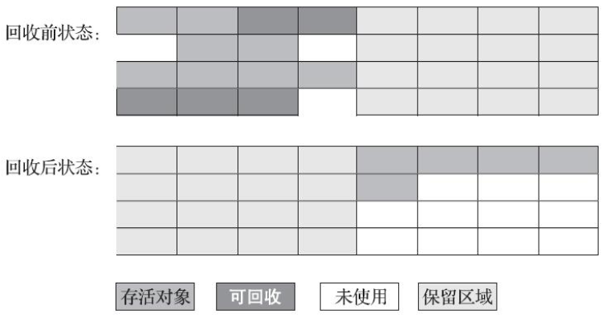
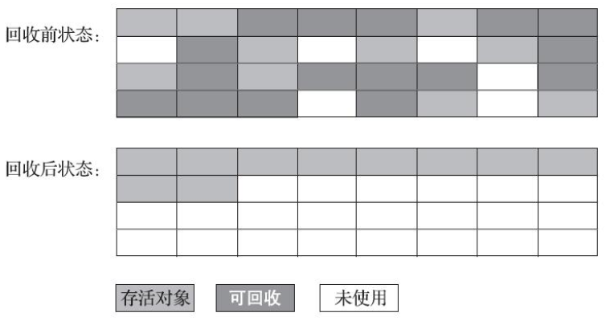

# 一、Java内存区域


## 1.程序计数器
程序计数器是一块较小的内存空间，它可以看作是当前线程所执行的字节码的行号指示器。  
为了线程切换后能恢复到正确的执行位置，每条线程都需要有一个独立的程序计数器。

## 2.Java虚拟机栈
虚拟机栈描述的是Java方法执行的线程内存模型。每个方法被执行的时候，Java虚拟机会创建一个栈帧用于存储局部变量表、操作数栈、常量池引用等信息。从方法调用直到执行完成的过程，对应着一个栈帧在Java虚拟机栈中入栈和出栈的过程。

该区域可能抛出的异常：
* 若线程请求的栈深度大于虚拟机所允许的深度，将抛出StackOverflowError异常
* 若Java虚拟机的栈容量可以动态扩展，当栈扩展至无法申请到足够的内存会抛出OutOfMemoryError异常

## 3.本地方法栈
本地方法栈和Java虚拟机栈类似，只是本地方法栈为执行本地方法服务，虚拟机栈为执行Java方法服务。  
注：本地方法一般是用其他语言（C、C++、汇编）编写的，并且被编译为基于本机硬件和操作系统的程序。

## 4.Java堆
此区域的唯一目的就是存放对象实例，它也是垃圾收集器管理的内存区域。  
Java堆在虚拟机启动时创建，被所有线程共享，是虚拟机管理的内存区域中最大的一块。

现代的垃圾收集器基本都采用分代收集算法，即针对不同类型的对象采取不同的垃圾回收策略。因此可以把Java堆分成新生代和老生代这两部分区域。

## 5.方法区
用于存放类相关的信息，如类名、常量、静态变量、方法描述、即时编译器编译后的代码等数据。被所有线程共享。  
这个区域的垃圾回收的主要目标是对常量池的回收和对类的卸载。

运行时常量池也是方法区的一部分，class文件中的常量池会在类加载后被放入这个区域。

## 对象的创建、内存布局和访问
### 1.对象的创建
* 给对象分配内存（两种方法：指针碰撞、空闲列表）
* 将分配到的内存空间都初始化为零值
* 用构造函数根据使用者的意愿对对象进程初始化

### 2.对象的内存布局
在HotSpot虚拟机中，对象在内存中的存储布局可以分为以下三部分：
* 对象头：包括Mark Word（哈希码、GC分代年龄等）和类型指针（虚拟机通过这个指针来确定该对象是哪个类的实例）
* 实例数据：对象真正存储的有用信息
* 对齐填充；任何对象的大小都必须是8字节的整数倍，因此如果对象实例数据部分没有对齐的话，就需要通过填充对齐来补全。

### 3.对象的访问定位
Java程序会通过栈上的reference数据来操作堆上的具体对象。对象的访问方式有以下两种：
* 使用句柄访问：reference中存储的是对象的句柄地址，而句柄中包含了对象实例数据和类型数据各自具体的地址信息。好处是reference存储的是稳定句柄地址，在对象被移动时只会改变句柄的实例数据指针，而reference本身不需要修改。
* 直接指针访问；reference中存储的直接就是对象地址。好处是节省了一次指针定位的时间开销，访问速度更快。


内存溢出和内存泄漏的区别：
* 内存泄漏：已经分配的堆内存由于某些原因无法释放
* 内存溢出：没有足够的内存再供分配了

# 二、垃圾收集与内存分配
在Java的内存区域中：程序计数器、虚拟机栈、本地方法栈这三个区域属于线程私有，当线程结束时内存自然就跟着回收了。因此只需要对Java堆和方法区进行垃圾收集。
## 判断哪些对象需要被回收
### 1.引用计数算法
在对象中添加一个引用计数器，每当有一个地方引用它时，计数器就加一；当引用失效时，计数器就减一；计数器为0的对象可被回收。

缺陷：当两个对象存在循环引用时，引用计数器永不为0，导致无法对这两个对象进行回收。  正是因为这个缺陷的存在，Java虚拟机不使用引用计数算法来判断对象的存活与否。

例如：对象objA和objB都有字段instance，赋值令objA.instance=objB及objB.instance=objA，除此之外，这两个对象再无任何引用，实际上这两个对象已经不可能再被访问，但是它们因为互相引用着对方，导致它们的引用计数都不为零，引用计数算法也就无法回收它们。

### 2.可达性分析算法
Java虚拟机使用可达性分析算法判断对象是否可被回收。其以GC Roots作为起始节点集开始根据引用关系向下搜索，可达的对象存活，不可达的对象可被回收。

GC Roots包括如下：
* 虚拟机栈中引用的对象
* 方法区中类静态属性所引用的对象（例如引用类型静态变量）
* 方法区中常量引用的对象（字符串常量池中的引用）
* 所有被同步锁（synchronized关键字）所持有的对象
* 等等
  


**四种引用关系：**
* 强引用：使用new关键字创建的引用，例如Object obj = new Object()。只要强引用关系还存在，垃圾收集器就永远不会回收被引用的对象。
* 软引用：在系统将要发生内存溢出异常之前，先将软引用关联的对象列进回收范围进行第二次回收。如果这次回收后还没获得足够的内存，才会抛出内存溢出异常。
* 弱引用：一旦垃圾收集器开始工作，无论当前内存是否足够，都会回收只被弱引用关联的对象。
* 虚引用：又称为幽灵引用或者幻影引用，一个对象是否有虚引用的存在，不会对其生存时间造成影响，也无法通过虚引用得到一个对象。为一个对象设置虚引用的唯一目的是能在这个对象被回收时收到一个系统通知。

**方法区的回收**  
方法区的垃圾收集主要回收废弃的常量和不再使用的类型。

因为方法区主要存放永久代对象，而永久代对象的回收率比新生代低很多，所以在方法区上进行回收性价比不高。
  


## 垃圾收集算法

### 分代收集理论
收集器应该将Java堆划分出不同的区域，然后将回收对象依据其年龄（年龄即对象熬过垃圾收集过程的次数）分配到不同的区域之中存储。    
设计者一般至少会把Java堆划分为新生代和老生代两个区域。在新生代中，每次垃圾收集时都发现有大批对象死去，而每次回收后存活的少量对象，将会逐步晋升到老生代中存放。
### 1.标记-清除算法
步骤：
* 首先标记出所有需要回收的对象
* 在标记完成后，统一回收所有被标记的对象

缺点：
* 执行效率不稳定（标记和清除两个过程的执行效率随对象数量增长而降低）
* 会产生大量的内存碎片，导致无法给大对象分配内存


### 2.标记-复制算法
此算法主要针对新生代。它将可用内存按照容量划分为大小相等的两块，每次只使用其中的一块。当这一块的内存用完了，就将还存活的对象复制到另一块上面，然后再把已使用过的内存空间一次清理掉。



现在的商业虚拟机大都采用这种收集算法回收新生代的内存，但是并不是划分为大小相等的两块，而是把新生代划分为一块较大的 Eden 空间和两块较小的 Survivor 空间，每次分配内存只使用 Eden 和其中一块 Survivor。在回收时，将 Eden 和 Survivor 中还存活着的对象全部复制到另一块 Survivor 上，最后清理 Eden 和使用过的那一块 Survivor。

当Survivor空间不足以容纳一次MinorGC之后存活的对象时，就需要依赖其他内存区域（老年代）进行分配担保，即借用老年代的空间存储放不下的对象。

### 3.标记-整理算法
此算法主要针对老年代。其中的标记过程仍然与标记清除算法一样，但后续步骤不是直接对可回收对象进行清理，而是让所有存活的对象都向内存空间一端移动，然后直接清理掉边界以外的内存。

此算法缺点在于：需要移动大量对象，处理效率比较低。优点在于不会产生内存碎片。



Java虚拟机为什么要划分为新生代和老年代？  
分代收集可以让我们根据各个年代的特点选择合适的垃圾收集算法。在新生代中，每次收集都会有大量对象死去，所以可以选择复制算法，只需要付出少量对象的复制成本就可以完成每次垃圾收集。而老年代的对象存活几率是比较高的，而且没有额外的空间对它进行分配担保，所以我们必须选择“标记-清除”或“标记-整理”算法进行垃圾收集。

## 垃圾收集器


### 1.Serial收集器
Serial收集器是一个单线程工作的收集器。它在进行收集时，必须暂停所有工作线程，直到它收集结束。


Serial收集器对运行在客户端模式下的虚拟机来说是很好的选择。因为这种场景下内存不会特别大，停顿时间可以接收

### 2.ParNew收集器
多线程版本的Serial收集器。

适用于服务端模式的新生代垃圾收集。除了Serial之外，只有它能和CMS配合使用。也可以理解为，ParNew合并入CMS，成为它专门处理新生代的组成部分。


**并行和并发区分**：  
* 并行：并行描述的是多条垃圾收集器线程之间的关系
* 并发：并发描述的是垃圾收集器线程与用户线程之间的关系
### 3.Parallel Scavenge收集器
吞吐量优先收集器

其他垃圾收集器的目标是尽可能缩短垃圾收集时用户线程的停顿时间。而此收集器的目标是达到一个可以控制的吞吐量。吞吐量是指CPU用于运行用户代码的时间和总时间（运行用户代码时间+运行垃圾收集时间）的比值。

顿时间越短就越适合需要与用户交互或需要保证服务响应质量的程序，良好的响应速度能提升用户体验；而高吞吐量则可以最高效率地利用处理器资源，尽快完成程序的运算任务，主要适合在后台运算而不需要太多交互的分析任务。

垃圾收集停顿时间的缩短是以牺牲吞吐量和新生代空间为代价获取的。（新生代空间变小，虽然每次的垃圾回收时间缩短，但是垃圾回收变得频繁，进而导致吞吐量下降）
### 4.Serial Old收集器
Serial的老年代版本，同样是一个单线程收集器。它有两大用途：
* 在 JDK1.5 以及以前的版本中与 Parallel Scavenge 收集器搭配使用
* 作为 CMS 收集器的后备方案
  
### 5.Parallel Old收集器
Parallel Scavenge收集器的老年代版本


在注重吞吐量或者处理器资源较为稀缺的场合，可以优先考虑Parallel Scavenge加Parallel Old收集器这个组合
### 6.CMS收集器
CMS(Concurrent Mark Sweep)收集器是一种以获取最短回收停顿时间为目标的老年代收集器。它是基于标记-清除算法实现的。

分为以下四个步骤：
1. 初始标记：仅仅标记一下GC Roots能直接关联到的对象，速度很快，需要停顿。
2. 并发标记：从GC Roots的直接关联对象开始遍历整个对象图的过程。耗时最长但是不需要停顿，可以与用户线程并发运行
3. 重新标记：为了修正并发标记期间因用户程序继续运作而导致标记产生变动的那一部分对象的标记记录。需要停顿。
4. 并发清除：清除掉已经标记的死亡对象，不需要停顿。

由于在整个过程中耗时最长的并发标记和并发清除阶段中，垃圾收集器线程都可以和用户线程一起工作，所以从总体上说，CMS收集器的内存回收过程是与用户线程一起并发执行的。


缺点如下：
1. 基于标记-清除算法，会产生很多内存碎片。往往会出现老年代还有大量空间剩余，但无法找到足够大连续空间来分配当前对象，不得不提前触发一次Full GC的情况。
2. 无法处理浮动垃圾。浮动垃圾是指并发标记和并发清理阶段由于用户线程继续运行而产生的垃圾。这一部分垃圾出现在标记过程之后，CMS无法在当次收集中处理掉它们，只好留到下一次垃圾收集时清理。由于浮动垃圾的存在，因此需要预留出一部分内存，意味着 CMS 收集不能像其它收集器那样等待老年代快满的时候再回收。如果预留的内存不够存放浮动垃圾，就会出现 Concurrent Mode Failure，这时虚拟机将临时启用 Serial Old 来替代 CMS，这样停顿时间就长了。
3. 吞吐量低：低停顿时间是以牺牲吞吐量为代价的，在并发阶段，它虽然不会导致用户线程停顿，但却会因为占用了一部分线程（或者说处理器的计算能力）而导致应用程序变慢，降低总吞吐量。
### 7.G1收集器
G1(Garbage First)收集器是一款面向服务端应用的垃圾收集器。在多CPU和大内存场景下有很好的性能。

G1收集器不像其他收集器一样只对新生代或老年代进行回收，它可以直接对新生代和老年代一起回收。衡量标准不再是它属于哪一个分代，而是哪块内存中存放的垃圾数量最多，回收收益最大。这就是G1收集器的Mixed GC模式。

G1不再坚持固定大小以及固定数量的分代区域划分，而是把连续的Java堆划分为多个大小相等的独立区域（Region），收集器能够对扮演不同角色的Region采用不同的策略处理。

通过引入 Region 的概念，从而将原来的一整块内存空间划分成多个的小空间，使得每个小空间可以单独进行垃圾回收。这种划分方法带来了很大的灵活性，使得可预测的停顿时间模型成为可能。通过记录每个 Region 垃圾回收时间以及回收所获得的空间（这两个值是通过过去回收的经验获得），并维护一个优先列表，每次根据允许的收集时间，优先回收价值最大的 Region。

G1收集器的工作步骤：
* 初始标记
* 并发标记
* 最终标记
* 筛选回收  
除了并发标记以外，其余步骤都要完全暂停用户线程


G1收集器的特点：
* 可预测的停顿：G1 除了追求低停顿外，还能建立可预测的停顿时间模型，能让使用者明确指定消耗在 GC 上的时间不得超过 N 毫秒
* 空间整合：G1从整体来看是基于“标记-整理”算法实现的收集器，但从局部（两个Region之间）上看又是基于“标记-复制”算法实现，无论如何，这两种算法都意味着G1运作期间不会产生内存空间碎片，垃圾收集完成之后能提供规整的可用内存。这种特性有利于程序长时间运行，在程序为大对象分配内存时不容易因无法找到连续内存空间而提前触发下一次收集

## 内存分配和回收策略
* 对象优先在新生代的Eden上分配，当Eden空间不够时，发起MinorGC
* 大对象直接进入老年代
* 长期存活的对象进入老年代
---

# 三、类加载机制
在Class文件中描述的各类信息，最终都需要加载到虚拟机中才能被运行和使用。而虚拟机如何加载这些Class文件、Class文件中的信息进入到虚拟机中会发生什么变化，这些是类加载机制要处理的内容。

虚拟机的类加载机制：Java虚拟机把描述类的数据从Class文件加载到内存，并对数据进行校验、转换解析和初始化，最终形成可以被虚拟机直接使用的Java类。

在Java中，类加载是在程序运行期间完成的。即，第一次使用到一个类时才对其进行加载，而不是一次性加载所有类（会占用很大的内存）

## 类的生命周期


## 类加载过程
类的生命周期中前五个阶段：加载、验证、准备、解析、初始化构成了类加载过程。

### 1.加载
在加载阶段，Java虚拟机完成了以下三件事情：
* 通过一个类的全限定名来获取定义此类的二进制字节流（可以通过ZIP包、网络、数据库等途径获取）
* 将这个字节流所代表的静态存储结构转化为方法区的运行时数据结构
* 在内存中生成一个代表该类的Class对象，作为方法区中该类各种数据的访问入口

数组类型不通过类加载器创建，它由 Java 虚拟机直接创建。此外所有的类都由类加载器加载，加载的作用就是将 .class文件加载到内存。


加载阶段和连接阶段的部分内容是交叉进行的，加载阶段尚未结束，连接阶段可能就已经开始了。

### 2.验证
确保Class文件的字节流中包含的信息符合要求，不会危害虚拟机自身的安全。

Class文件并不一定只能从Java源码编译而来，虽然Java语言本身相对安全，但Java无法做到的事情在字节码层面上却有可能实现。所以如果虚拟机不检查输入的字节流的话，很可能会因为载入了有错误或有恶意企图的字节码流而导致系统收到攻击。


### 3.准备
准备阶段是正式为类中定义的变量（静态变量）在方法区中分配内存并设置类变量初始值（通常为零值）的阶段。

注意：这个阶段只为静态变量分配内存，实例变量不会在这阶段分配内存，它会在对象实例化时随着对象一起被分配在堆中。因为实例化不是类加载的一个过程，类加载发生在所有实例化操作之前，并且类加载只进行一次，实例化可以进行多次。

在准备阶段设置的初始值一般为零值，例如下面的value变量在这个阶段将被初始化为0(之后的初始化阶段才会被具体赋值)
```java
public static int value = 123;
```
特殊情况：如果value是常量，那么它就会被初始化为表达式所定义的值123
```java
public static final int value = 123;
```

### 4.解析
解析阶段是Java虚拟机将常量池内的**符号引用**替换为**直接引用**的过程，也就是得到类或者字段、方法在内存中的指针或者偏移量。

符号引用就是一组符号来描述目标，可以是任何字面量。直接引用就是直接指向目标的指针、相对偏移量或一个间接定位到目标的句柄。

例如：在程序执行方法时，系统需要明确知道这个方法所在的位置。Java虚拟机为每个类都准备了一张方法表来存放类中所有的方法。当需要调用一个类的方法的时候，只要知道这个方法在方法表中的偏移量就可以直接调用该方法了。通过解析阶段符号引用就可以直接转变为目标方法在类中方法表的位置，从而使得方法可以被调用。

### 5.初始化
在初始化阶段，Java虚拟机才真正开始执行类中编写的Java代码，将主导权从虚拟机移交给应用程序。

初始化阶段是执行类构造器 < clinit >() 的过程。在准备阶段，类变量已经赋过一次系统要求的初始零值，而在初始化阶段，根据使用者通过程序制定的主观计划去初始化类变量和其它资源。

< clinit >() 是由编译器自动收集类中所有静态变量的赋值动作和静态语句块中的语句合并产生的，编译器收集的顺序由语句在源文件中出现的顺序决定。特别注意的是，静态语句块只能访问到定义在它之前的类变量，定义在它之后的类变量只能赋值，不能访问。例如：
```java
public class Test {
    static {
        i = 0;                // 给变量赋值可以正常编译通过
        System.out.print(i);  // 这句编译器会提示“非法向前引用”
    }
    static int i = 1;
}
```

虚拟机会保证一个类的 < clinit >() 方法在多线程环境下被正确的加锁和同步，如果多个线程同时初始化一个类，只会有一个线程执行这个类的 < clinit >() 方法，其它线程都会阻塞等待，直到活动线程执行 < clinit >() 方法完毕。

## 类加载器与双亲委派模型
Java虚拟机的设计者将类加载阶段中的“通过一个类的全限定名来获取描述该类的二进制字节流”这个动作放到Java虚拟机外部去实现，以便让应用程序自己去决定如何去获取所需的类。实现这个动作的代码被称为“类加载器”（Class Loader)

每一个类加载器，都有一个独立的类命名空间。即使两个类来源于同一个Class文件，被同一个Java虚拟机加载，但只要加载它们的类加载器不同，那这两个类就必定不相等。（两个类相互独立）

### 类加载器分类
从Java虚拟机的角度看，类加载器只分为以下两种：
* 启动类加载器（Bootstrap ClassLoader)：使用C++实现，是虚拟机自身的一部分。
* 其他类加载器：使用Java语言实现，独立于虚拟机之外，全部继承自抽象类java.lang.ClassLoader

从Java开发人员的角度看，类加载器可以分为以下的三层类加载器：
* 启动类加载器（Bootstrap ClassLoader): 这个加载器将存放在 <JAVA_HOME>\lib 目录下的，能被虚拟机识别的类库加载到虚拟机内存中（按照文件名识别，如 rt.jar）。启动类加载器无法被 Java 程序直接引用，用户在编写自定义类加载器时，如果需要把加载请求委派给启动类加载器，直接使用 null 代替即可。
* 扩展类加载器（Extension ClassLoader)：这个加载器将 <JAVA_HOME>/lib/ext 目录中的、或者被 java.ext.dir 系统变量所指定的路径中所有的类库加载到虚拟机内存中。由于类加载器是Java代码实现的，开发者可以直接在程序中使用扩展类加载器来加载Class文件。
* 应用程序类加载器（Application ClassLoader)：也称为“系统类加载器”，它负责加载用户类路径（ClassPath）上所有的类库。开发者同样可以直接在代码中使用这个类加载器，如果应用程序中没有自定义过自己的类加载器，一般情况下这个就是程序中默认的类加载器。

### 双亲委派模型
Java应用通过以上三种类加载器的相互配合来完成类加载，此外用户也可以加入自定义的类加载器来进行拓展。类加载器的层次关系如下所示，这种关系被称为双亲委派模型：


双亲委派模型要求除了顶层的启动类加载器外，其余的类加载器都应该有自己的父类加载器。注意：类加载器的父子关系不是以继承(is-a)来实现的，而是以组合(has-a)来实现的。

**工作过程**：  
每个类加载器都先将类加载请求委派给父类加载器去处理，所以最后所有的加载请求都传送到最顶层的启动类加载器中，只有当父类加载器反馈自己无法完成这个加载请求时，自加载器才会尝试自己去完成加载。

Java官方API文档的描述如下：
> The Java platform uses a delegation model for loading classes. The basic idea is that every class loader has a "parent" class loader. When loading a class, a class loader first "delegates" the search for the class to its parent class loader before attempting to find the class itself.

**好处**  
Java中的类随着它的类加载器一起具备了一种带有优先级的层次关系，可以使基础类得到统一。

例如：存放在rt.jar中的类java.lang.Object，无论哪一个类加载器要加载这个类，最终都将委派给处于模型顶端的启动类加载器进行加载，因此能保证程序中加载的所有的Object类都是同一个类（正如前述：相同的类文件被不同的类加载器加载产生的是两个不同的类）。

反之，如果没有双亲委派模型，如果编写另外一个 java.lang.Object 并放到 ClassPath 中，它将会被应用程序类加载器加载，这样程序中就会有多个Object类，造成混乱。

**实现**  
双亲委派模型的代码全部集中在java.lang.ClassLoader的loadClass()方法中
```java
public abstract class ClassLoader {
    private final ClassLoader parent;
    protected synchronized Class<?> loadClass(String name, boolean resolve) throws ClassNotFoundException
    {
        // 首先，检查请求的类是否已经被加载过了
        Class c = findLoadedClass(name);
        if (c == null) {
            try {
            if (parent != null) {
                c = parent.loadClass(name, false);
            } else {
                c = findBootstrapClassOrNull(name);
            }
            } catch (ClassNotFoundException e) {
                // 如果父类加载器抛出ClassNotFoundException
                // 说明父类加载器无法完成加载请求
            }
            if (c == null) {
                // 在父类加载器无法加载时
                // 再调用本身的findClass方法来进行类加载
                c = findClass(name);
            }
        }
        if (resolve) {
            resolveClass(c);
        }
        return c;
    }

    protected Class<?> findClass(String name) throws ClassNotFoundException {
        throw new ClassNotFoundException(name);
    }
}
loadClass()方法的运行逻辑：先检查请求加载的类是否已经被加载过，若没有则调用父加载器的loadClass()方法，若父加载器为空则默认使用启动类加载器作为父加载器。只有当父加载器加载失败，抛出ClassNotFoundException异常时，才调用自己的findClass()方法尝试进行加载。
```
**自定义类加载器**  
除了 BootstrapClassLoader 其他类加载器均由 Java 实现且全部继承自java.lang.ClassLoader。如果我们要自定义自己的类加载器，就需要继承 ClassLoader。
* 如果想打破双亲委派模型，就需要重写loadClass()方法，因为双亲委派模型的逻辑是由loadClass()方法体现的。
* 如果不想打破双亲委派模型，就重写 ClassLoader 类中的 findClass() 方法即可，无法被父类加载器加载的类最终会通过这个方法被加载。

## 参考
* 周志明. 深入理解 Java 虚拟机 [M]. 机械工业出版社, 2019.
* [Cyc2018/CS-Nodes](https://github.com/CyC2018/CS-Notes)
* [Snailclimb/JavaGuide](https://github.com/Snailclimb/JavaGuide)
