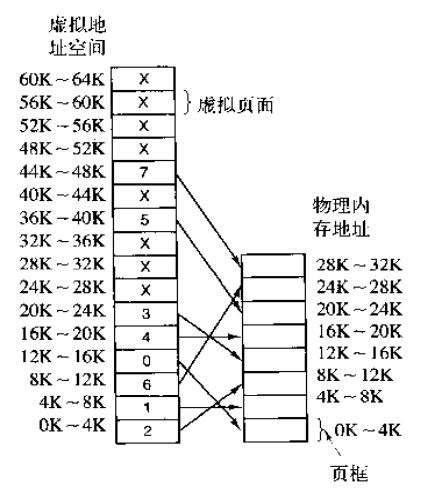
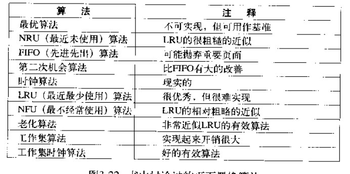
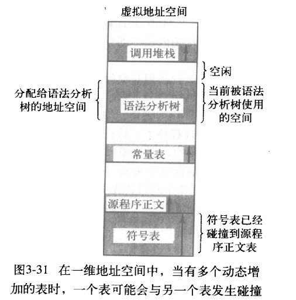
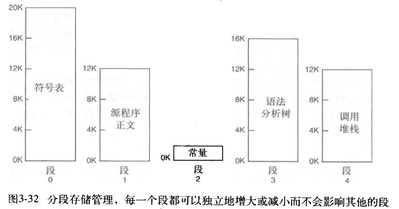
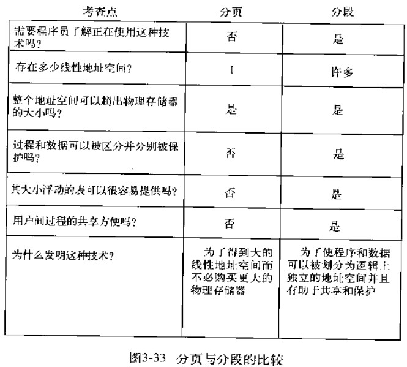

# 存储管理

## 1.地址空间
就像进程的概念创造了一类抽象的CPU以运行程序一样，地址空间为程序创造了一种抽象的内存。地址空间是一个进程可用于寻址内存的一套地址集合。每个进程都有一个自己的地址空间，并且这个地址空间独立于其他进程的地址空间。

即要做到的是：给每个程序一个自己的地址空间，使得一个程序中的地址28所对应的物理地址与另一个程序中的地址28所对应的物理地址不同。

一种为每个进程提供私有地址空间的简单方式是：使用两个寄存器，程序的起始物理地址装载到**基址寄存器**中，程序的长度装载到**界限寄存器**中。每个内存地址在送到内存之前，都会自动先加上基址寄存器的内容。

---

如果把所有进程一直保存在内存中需要巨大的内存，如果内存不够，就做不到这一点。处理这种内存超载问题有以下两种方式
* 交换技术  
  把一个进程完整地调入内存，使该进程运行一段时间，然后把它存回磁盘。空闲进程主要在磁盘上，所以当它们不运行时就不会占用内存。但是受限于磁盘传输速率限制，将进程从磁盘调出和换入通常需要不短的时间。
* 虚拟内存（使得程序在只有一部分被调入内存的情况下运行）

## 2.虚拟内存
虚拟内存的目的是为了让物理内存扩充成更大的逻辑内存，从而让程序获得更多的可用内存。

虚拟内存的基本思想是：每个程序都有自己的地址空间，这个空间被分割成多个块，每个块称作一个页面(page)。每一页有自己连续的地址范围，这些页被映射到物理内存，但并不是所有的页都必须在内存中才能运行程序。当程序引用到一部分在物理内存中的页时，由硬件执行必要的映射。当程序引用到不在物理内存中的页时，操作系统负责将缺失的部分装入物理内存并重新执行失败的指令。、

从上面的描述中可以看出，虚拟内存允许程序不用将地址空间中的每一页都映射到物理内存，也就是说一个程序不需要全部调入内存就可以运行，这使得有限的内存运行大程序成为可能。例如有一台计算机可以产生 16 位地址，那么一个程序的地址空间范围是 0~64K，这些地址是虚拟地址。该计算机只有 32KB 的物理内存，虚拟内存技术允许该计算机运行一个 64K 大小的程序。

注意：在使用虚拟内存的情况下，虚拟地址不是直接被送到内存总线上，而是被送到内存管理单元（MMU），MMU把虚拟地址映射成为物理内存地址。



虚拟地址空间按照固定大小划分成称为页面(page)的若干单元。在物理内存中对应的单元成为页框(page frame)

如果程序访问到一个未映射的页面，内存管理单元MMU法线该页没有被映射（图中用X表示），于是使CPU陷入到操作系统，这里称为***缺页中断*** (page fault)。操作系统找到一个很少使用的页框且把它的内容写入磁盘，然后把需要访问的页面读到刚才回收的页框中，修改映射关系，然后重新启动引起陷阱的指令。


### 页表
页表的目的是把虚拟页面映射为相应的页框。每个进程需要自己的页表（因为它有自己的虚拟地址空间）

虚拟内存的本质上是用来创造一个新的抽象概念——地址空间。这个概念是对物理内存的抽象，类似于进程是对物理机器(CPU)的抽象。虚拟内存的实现，是将虚拟地址空间分解成页，并将每一页映射到物理内存的某一页。

## 3.页面置换算法
在程序运行过程中，如果要访问的页面不在内存中，就发生缺页中断从而将该页调入内存中。此时如果内存已无空闲空间，系统必须从内存中调出一个页面到磁盘对换区中来腾出空间。

页面置换算法的主要目标是使页面置换频率最低（也可以说缺页率最低）。

### 1. 最优页面置换算法

> OPT, Optimal replacement algorithm

所选择的被换出的页面将是最长时间内不再被访问，通常可以保证获得最低的缺页率。
此算法是一种理论上的算法，因为无法知道一个页面多长时间不再被访问。

举例：一个系统为某进程分配了三个物理块，并有如下页面引用序列：

```html
7，0，1，2，0，3，0，4，2，3，0，3，2，1，2，0，1，7，0，1
```

开始运行时，先将 7, 0, 1 三个页面装入内存。当进程要访问页面 2 时，产生缺页中断，会将页面 7 换出，因为页面 7 再次被访问的时间最长。

### 2. 最近最久未使用页面置换算法

> LRU, Least Recently Used

虽然无法知道将来要使用的页面情况，但是可以知道过去使用页面的情况。LRU 将最近最久未使用的页面换出。

为了实现 LRU，需要在内存中维护一个所有页面的链表。当一个页面被访问时，将这个页面移到链表表头。这样就能保证链表表尾的页面是最近最久未访问的。

因为每次访问都需要更新链表，因此这种方式实现的 LRU 代价很高。

### 3. 先进先出

> FIFO, First In First Out

选择换出的页面是最先进入的页面。  
该算法会将那些经常被访问的页面换出，导致缺页率升高。

### 4. 第二次机会算法

FIFO 算法可能会把经常使用的页面置换出去，为了避免这一问题，对该算法做一个简单的修改：

当页面被访问 (读或写) 时设置该页面的 R 位为 1。需要替换的时候，检查最老页面的 R 位。如果 R 位是 0，那么这个页面既老又没有被使用，可以立刻置换掉；如果是 1，就将 R 位清 0，并把该页面放到链表的尾端，修改它的装入时间使它就像刚装入的一样，然后继续从链表的头部开始搜索。

### 6. 时钟

> Clock

第二次机会算法需要在链表中移动页面，降低了效率。时钟算法使用环形链表将页面连接起来，再使用一个指针指向最老的页面。

### 7.工作集页面置换算法
一个进程正在使用的页面的集合称为它的工作集（working set）。如果整个工作集都被装入到了内存中，那么进程在运行到下一个阶段之前，不会产生很多缺页中断。若内存太小而无法容纳下整个工作集，那么进程的运行过程中会产生大量的缺页中断，导致运行速度也会变得很缓慢。若每执行几条指令程序就发生一次缺页中断，那么就称这个程序发生了颠簸（thrashing）

不少分页系统都会跟踪进程的工作集，以确保在让进程运行之前，它的工作集就已经在内存中了。该方法称为工作集模型，其目的在于大大减少缺页中断。在让进程运行前预先装入其工作集页面也成为预先调页(prepaging)

基于工作集的页面置换算法的基本思路就是找出一个不在工作集中的页面并淘汰它。



最好的两种算法是老化算法和工作集时钟算法


## 4.分段
虚拟内存采用的是分页技术，也就是将地址空间划分成固定大小的页，每一页再与物理内存进行映射。



下图为一个编译器在编译过程中建立的多个表，有 4 个表是动态增长的，如果使用分页系统的一维地址空间，动态增长的特点会导致覆盖问题的出现。

分段的做法是把每个表分成段，一个段(segment)构成一个独立的地址空间。每个段的长度可以不同，并且可以动态增长。它们既不会影响到其他的段，地址空间中也没有任何其他东西阻挡它增长。



使用段的好处是：
* 简化对长度经常变动的数据结构的管理
* 简化链接操作
* 简化修改
* 有助于在几个进程之间共享过程和数据

### 分段与分页的结合
程序的地址空间划分成多个拥有独立地址空间的段，每个段上的地址空间划分成大小相同的页。这样既拥有分段系统的共享和保护，又拥有分页系统的虚拟内存功能。

### 分页与分段的比较
* 对程序员的透明性：分页透明，但是分段需要程序员显式划分每个段。
* 地址空间的维度：分页是一维地址空间，分段是二维的。
* 大小是否可以改变：页的大小不可变，段的大小可以动态改变。
* 出现的原因：分页主要用于实现虚拟内存，从而获得更大的地址空间；分段主要是为了使程序和数据可以被划分为逻辑上独立的地址空间并且有助于共享和保护。


