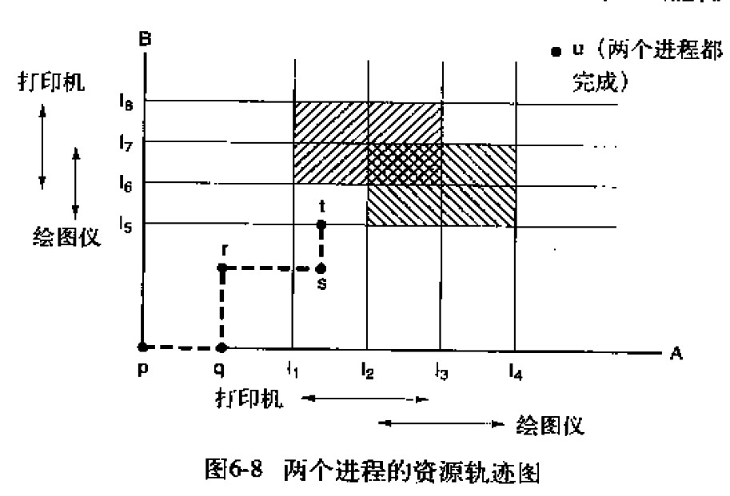
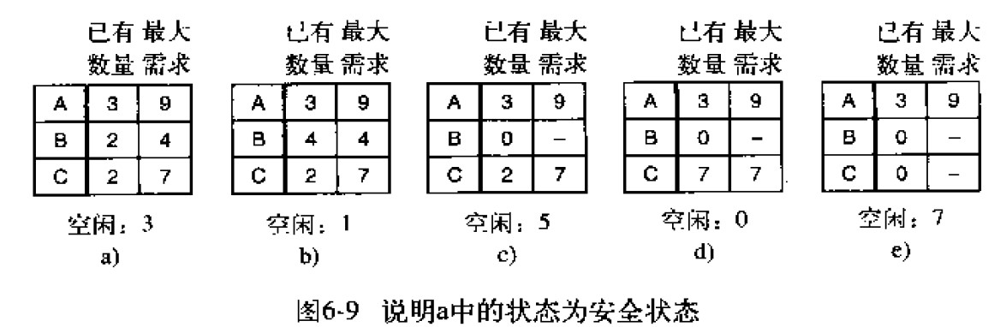
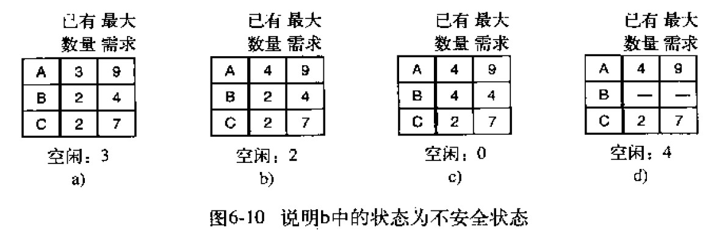
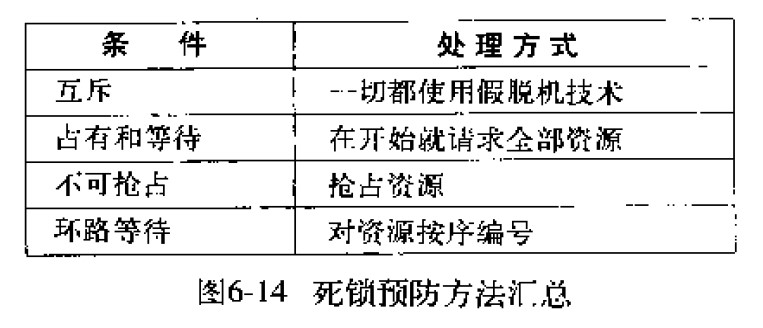

# 死锁

## 1.资源

在进程对设备、文件等资源取得了排他性的访问权时，有可能会出现死锁。

资源可以分为如下两类：
* 可抢占资源：可以从拥有它的进程中抢占而不会产生任何副作用（比如存储器）
* 不可抢占资源：在不引起相关计算失败的情况下，无法把它从占有它的进程中抢占过来（比如CD刻录机）

考虑这样一种情况：进程A获取了资源1，进程B获取了资源2，每个进程如果都想请求另一个资源就会被阻塞，那么每个进程都无法继续运行。这种情况就是死锁。

## 2.死锁的条件
* **互斥条件**：每个资源要么已经分配给了一个进程，要么就是可用的。
* **占有和等待条件**：已经得到了某个资源的进程可以再请求新的资源。
* **不可抢占条件**：已经分配给一个进程的资源不能强制被抢占，它只能被占有它的进程显式地释放。
* **环路等待条件**：死锁发生时，系统中一定有由两个或两个以上的进程组成的一条环路，该环路中的每个进程都在等待着下一个进程所占有的资源。
  
死锁发生时，以上四个条件必须同时满足。

## 3.处理方法
有以下四种处理死锁的策略：
* **鸵鸟策略**：忽略该问题
* **死锁检测并恢复**：让死锁发生，检测它们是否发生，一旦发生死锁，采取行动解决问题。
* **死锁避免**：仔细对资源进行分配，动态地避免死锁。
* **死锁预防**：通过破坏死锁的四个条件，防止死锁的产生。

### **3.1 鸵鸟策略**
像鸵鸟一样，把头埋在沙子里，假装根本没发生问题。  
因为解决死锁问题的代价很高，因此鸵鸟策略这种不采取任何措施的方案会获得更高的性能。  
当发生死锁时不会对用户造成多大影响，或发生死锁的概率很低，可以采用鸵鸟策略。  
大多数操作系统，包括 Unix，Linux 和 Windows，处理死锁问题的办法仅仅是忽略它。

### **3.2 死锁检测并恢复**
核心思想：系统并不试图阻止死锁的发生，而是允许死锁发生。当检测到死锁发生时，采取措施进行恢复。

死锁恢复：
* 利用抢占恢复：将某一资源从一个进程强行取走给另一个进程使用，接着又送回。
* 利用回滚恢复：将一个进程复位到一个更早的状态，那是它还没有取得所需的资源，接着就把这个资源分配给一个死锁进程。如果复位后的进程试图重新获得对该资源的控制，它就必须一直等到该资源可用时为止。
* 通过杀死进程恢复：杀掉环中的一个进程，打破死锁。

### **3.3 死锁避免**
资源轨迹图：

图中阴影部分表示该区域内两进程都拥有打印机或都拥有绘图仪，互斥使用的规则决定了不可能进入该区域。

在点t，进程B请求资源。系统必须决定是否分配。如果系统把资源分配给B，系统进入不安全区域。要避免死锁，应该将进程B挂起，直到A请求并释放绘图仪。

**安全状态和不安全状态**  
如果死锁没有发生，并且即使所有进程突然请求对资源的最大需求，也让然存在某种调度次序能够使得每一个进程运行完毕，则称该状态是安全的。

下图所示的状态即为安全状态：

从图 a 开始出发，先让 B 拥有所需的所有资源（图 b），运行结束后释放 B，此时空闲数变为 5（图 c）；接着以同样的方式运行 C 和 A，使得所有进程都能成功运行，因此可以称图 a 所示的状态时安全的。

如果任何分配资源实例的序列都无法保证工作的完成，则从安全状态进入到了不安全状态。如下图所示：

注意：***不安全状态并不是死锁***。    
安全状态和不安全状态的区别是：从安全状态出发，系统能够保证所有进程都能完成，而从不安全状态出发，就没有这样的保证。

**银行家算法**  
银行家算法将客服比作进程，将贷款单位比作资源，将银行家比作操作系统。

银行家算法就是对每一个请求进行检查，检查如果满足这一请求是否会达到安全状态。若是，那么就满足该请求；若否，那么久推迟对这一请求的满足。为了看状态是否安全，银行家看他是否有足够的资源满足某个客户。如果可以，那么这笔投资认为是能够收回的，并且接着检查最接近最大限额的一个客户，以此类推。如果所有投资最终都被收回，那么该状态是安全的，最初的请求可以被批准。

## **3.4 死锁预防**  
通过破坏死锁的四个条件，防止死锁的产生。
* 破坏互斥条件：如果资源不被一个进程独占，那么死锁肯定不会发生。
* 破坏占有和等待条件：要求当一个进程请求资源时，先暂时释放其当前占有的所有资源，然后再尝试一次获得所需的全部资源。
* 破坏不可抢占条件：可以通过将一些资源虚拟化的方式来实现。
* 破坏环路等待条件：将资源进行编号，制定规则：进程可以在任何时候提出资源请求，但是所有资源请求必须按照资源编号的顺序退出。任何时候总有一个已分配的资源是编号最高的。占用该资源的进程不可能请求其他已分配的各种资源。它或者会执行完毕，或者最坏的情况是去请求编号更高的资源，而编号更高的资源肯定是可用的。最终，它会结束并释放所有的资源，这时其他占有最高编号资源的进程也可以执行完。简而言之，存在一种所有进程都可以执行完毕的情景，所以不会产生死锁。

