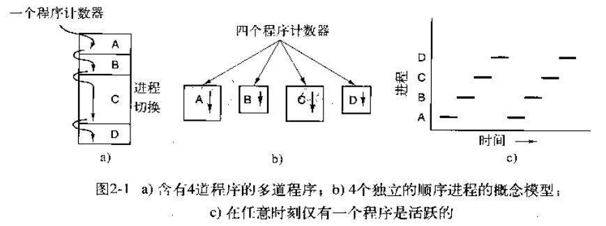
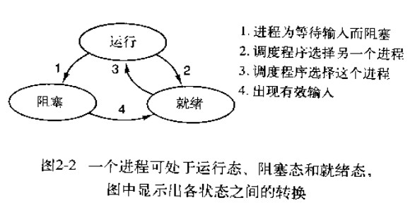
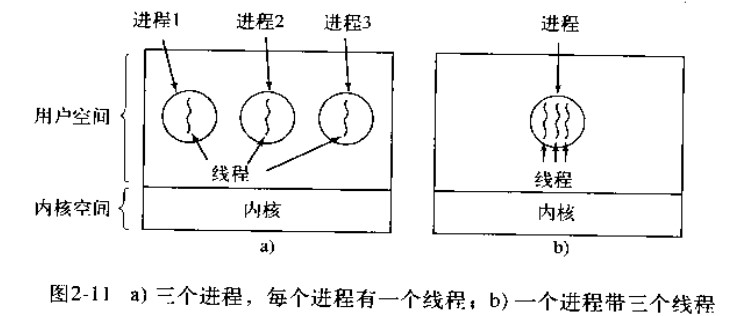
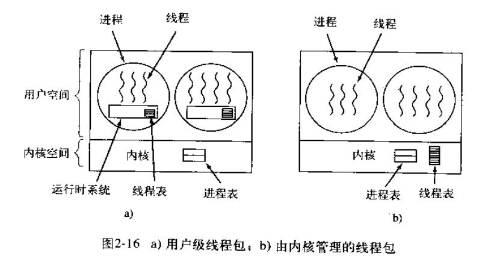
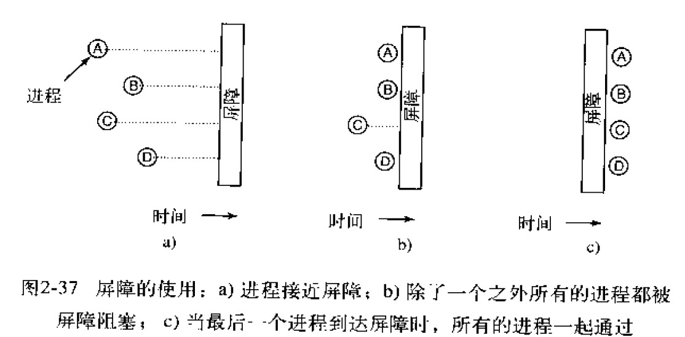
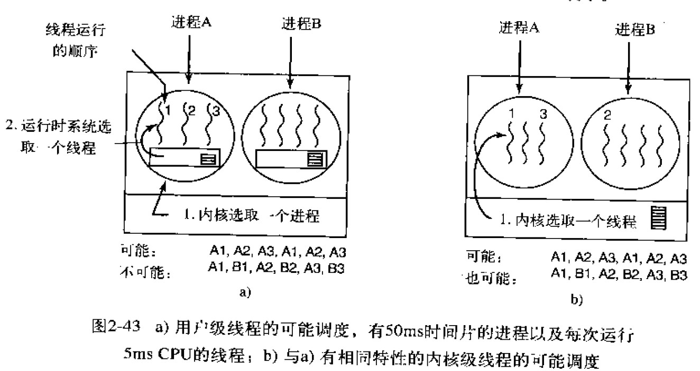
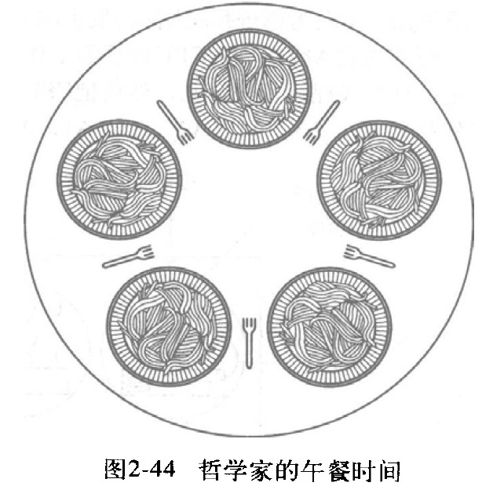

# 进程与线程

在任何多道程序设计系统中，CPU由一个进程快速切换至另一个进程，使得每个进程各运行几十或几百个毫秒。严格地说，在某一瞬间，CPU只能运行一个进程。但在1秒钟期间，它可能运行多个进程，这样就产生并行的错觉。

## 1.进程
一个进程是某种类型的一个活动，它有程序、输入、输出以及状态。单个处理器可以被若干个进程共享，它使用某种调度算法决定何时停止一个进程的工作，并转而为另一个进程提供服务。



停留在后台处理诸如电子邮件、Web页面、新闻、打印之类活动的进程成为守护进程。

### 进程的层次：  
当进程创建了另一个进程后，父进程和子进程就以某种形式继续保持关联。子进程自身可以创建更多的进程，组成一个进程的层次结构。（注意：父进程和子进程有着不同的地址空间）

在UNIX中，进程和它的所有子女以及后裔共同组成一个进程组。当用户从键盘发出一个信号时，该信号被送给当前与键盘相关的进程组的所有成员。而Windows中没有进程层次的概念。

### 进程的状态：  
进程的三个状态为：
* 运行态（该时刻进程实际占用CPU）
* 就绪态（可运行，但由于其他进程正在运行而暂时停止）
* 阻塞态（除非某种外部事件发生，否则进程不能运行）



调度程序的主要工作就是决定应当运行哪个进程、何时运行以及它应该运行多长时间（即图中的转换2和转换3）

### 进程的实现：  
为了实现进程模型，操作系统维护着一张进程表（process table)。每个进程占用一个进程表项。该表象包含了进程状态的重要信息，包括程序计数器、堆栈指针、内存分配情况、所打开文件的状态和调度信息，以及其他在进程中运行态转换到就绪态或阻塞态时必须保存的信息，从而保证该进程随后能再次启动，就像从未被中断过一样

## 2.线程

### 2.1 线程概述
线程是独立调度的基本单位。传统的操作系统中，每个进程有一个地址空间，并且只有一个控制线程。但由于以下原因需要使用多线程：  
  1. 多个线程之间共享同一个地址空间和所有可用数据。
  2. 由于线程比进程更轻量级，所以它们比进程更容易创建，也更容易撤销。
  3. 若多个线程都是CPU密集的，那么并不能获得性能的增强。但如果存在着大量的计算和大量的I/O处理，拥有多个线程允许这些活动彼此重叠进行，可以加快应用程序执行的速度。

例如：假设字处理软件被编写为含有两个线程的程序。一个线程与用户交互，而另一个线程在后台重新进行格式处理。一旦第一页的语句被删除掉，交互线程就立即通知格式化线程对整本书重新进行处理。进一步考虑，可以再增加一个处理磁盘备份的线程。  
如果程序是单线程的，那么在进行磁盘备份时，来自键盘和鼠标的交互命令就会被忽略，直到备份工作停止为止。如果使用三个线程，程序设计模型就很简单了。第一个和线程只是和用户交互；第二个线程在得到通知时进行文档的重新格式化；第三个线程周期性地将RAM中的内容写到磁盘上。  
但是在这里若使用三个进程是行不通的，这是因为三个线程都需要在同一个文件上进行操作。通过让三个线程代替三个进程，三个线程共享公共内存，于是它们都可以访问同一个正在编辑的文件。

再例如，对于那些必须处理极大量数据的应用。通常的单线程处理方式是，读进一块数据、对其处理、然后再写出数据。这里的问题是，如果只能使用阻塞系统调用，那么在数据写入和数据输出时，会阻塞进程。而在有大量计算需要处理的时候，让CPU空转显然是浪费，应该尽可能避免。  
但多线程提供了一个解决方案，有关的进程可以用一个输入线程、一个处理线程和一个输出线程构造。输入线程把数据读入到输入缓存区中，处理线程从输入缓存区读取数据、处理数据、并把结果放到输出缓存区中；处理线程从输入缓存区中读取数据、处理数据、并把结果放到输出缓存区中；输出线程再把这些结果写道磁盘上。按照这种方式工作，输入、处理和输出可以全部同时进行。当然，这种模型只有当系统调用只阻塞调用线程而不是调用进程时，才能正常工作。  

### 2.2 经典的线程模型
理解进程的一个角度是：用某种方法把相关的资源集中在一起，进程有存放程序正文和数据以及其他资源的地址空间。另一个概念是：进程拥有一个执行的线程(thread)。在线程中有一个程序计数器，用来记录接着要执行哪一条指令。线程拥有寄存器，用来保存线程当前的工作变量。线程还有一个堆栈，用来记录执行历史，其中每一帧保存了一个已调用的但是还没有从中返回的过程。

可以这样理解：***进程用于把资源集中在一起，而线程则是在CPU上被调度执行的实体。***  
即：在同一进程环境中，允许彼此之间有较大独立性的多个线程执行。在同一个进程中并行运行多个线程，是在同一台计算机上并行运行多个进程的模拟。在前一种情形下，多个线程共享同一个地址空间和其他资源。而在后一种情形中，多个进程共享物理内存、磁盘、打印机和其他资源。



进程中的不同线程不像不同进程之间那样存在着很大的独立性。所有的线程都有完全一样的地址空间，这意味着它们也共享同样的全局变量。由于各个线程都可以访问进程地址空间中的每一个内存地址，所以一个线程可以读、写、甚至清除另一个线程的堆栈。

* 线程概念试图实现的是：共享一组资源的多个线程的执行能力，以便这些线程可以为完成某一个任务而共同工作。
* 由于每一个线程都会调用不同的过程，从而有一个各自不同的执行历史，因此每个线程都有其自己的堆栈
* 所有线程都是平等的，不论有无层次关系。

### 2.3 线程的实现方式
* 在用户空间实现线程：此时，每个进程都有一个其专用的线程表(thread table)，用来跟踪该进程中的线程。
* 在内核实现线程：每个进程中没有线程表。相反，在内核中有用来记录系统中所有线程的线程表。



## 3.进程间通信
### 3.1 临界区
即：***对共享内存进行访问的程序片段***

如果两个或多个进程同时读写某些共享数据，其最后的结果会取决于进程运行的精确时序，称为竞争条件(race condition)。

要避免竞争条件，关键是要找出某种途径来阻止多个进程同时读写共享的数据。换言之，我们需要的是互斥(mutual exclusion),即以某种手段确保当一个进程使用一个共享变量或文件时，其他进程不能做同样的操作。

### 3.2 同步与互斥
* 互斥： 当一个进程在临界区内更新共享内存时，其他进程将不会进入其临界区。即：多个进程在同一时刻只有一个进程能进入临界区。
* 同步：多个进程因为合作产生的直接制约关系，使得进程有一定的先后执行关系。

注：连续测试一个变量直到某个值出现为止，称为忙等待(busy waiting)。由于这种方式浪费CPU时间，所以通常应该避免。


### 3.3 信号量
信号量（Semaphore）是一个整型变量，可以对其执行 down 和 up 操作，也就是常见的 P 和 V 操作。如果每个进程在进入临界区前都执行一个down操作，并在退出后都执行一个up操作，就能够实现互斥。

-   **down**   : 如果信号量大于 0 ，执行 -1 操作；如果信号量等于 0，进程睡眠，等待信号量大于 0；
-   **up**  ：对信号量执行 +1 操作，唤醒睡眠的进程让其完成 down 操作。

down 和 up 操作需要被设计成原语，不可分割，通常的做法是在执行这些操作的时候屏蔽中断。所谓原语，即原子操作，是指一组相关联的操作要么都不间断地执行，要么都不执行。

如果信号量的取值只能为 0 或者 1，那么就成为了   **互斥量（Mutex）**  ，0 表示临界区已经加锁，1 表示临界区解锁。

```c
typedef int semaphore;
semaphore mutex = 1;
void P1() {
    down(&mutex);
    // 临界区
    up(&mutex);
}
void P2() {
    down(&mutex);
    // 临界区
    up(&mutex);
}
```

### 3.4 互斥量
互斥量（mutex）是信号量的一个简化版本。  
互斥量是一种可以处于两态之一的变量：解锁和加锁。0表示解锁，其他所有的值则表示加锁。互斥量使用两个过程，当一个线程（或进程）需要访问临界区时，它调用mutex_lock。如果该互斥量当前是解锁的（即临界区可用），此调用成功，调用线程可以自由进入临界区，并且互斥量被自动锁定以防止其他线程进入。另一方面，如果该互斥量当前已经加锁，则调用线程被阻塞，直到在临界区中的线程完成并调用mutex_unlock。


<font size=3>   **使用信号量实现生产者-消费者问题**   </font> </br>

问题描述：使用一个缓冲区来保存物品，只有缓冲区没有满，生产者才可以放入物品；只有缓冲区不为空，消费者才可以拿走物品。

因为缓冲区属于临界资源，因此需要使用一个互斥量 mutex 来控制对缓冲区的互斥访问。

为了同步生产者和消费者的行为，需要记录缓冲区中物品的数量。数量可以使用信号量来进行统计，这里需要使用两个信号量：empty 记录空缓冲区的数量，full 记录满缓冲区的数量。其中，empty 信号量是在生产者进程中使用，当 empty 不为 0 时，生产者才可以放入物品；full 信号量是在消费者进程中使用，当 full 信号量不为 0 时，消费者才可以取走物品。

注意，不能先对缓冲区进行加锁，再测试信号量。也就是说，不能先执行 down(mutex) 再执行 down(empty)。如果这么做了，那么可能会出现这种情况：生产者对缓冲区加锁后，执行 down(empty) 操作，发现 empty = 0，此时生产者睡眠。消费者不能进入临界区，因为生产者对缓冲区加锁了，消费者就无法执行 up(empty) 操作，empty 永远都为 0，导致生产者永远等待下，不会释放锁，消费者因此也会永远等待下去，造成死锁

```c
#define N 100
typedef int semaphore;
semaphore mutex = 1;
semaphore empty = N;
semaphore full = 0;

void producer() {
    while(TRUE) {
        int item = produce_item();
        down(&empty);
        down(&mutex);
        insert_item(item);
        up(&mutex);
        up(&full);
    }
}
void consumer() {
    while(TRUE) {
        down(&full);
        down(&mutex);
        int item = remove_item();
        consume_item(item);
        up(&mutex);
        up(&empty);
    }
}
```

### 3.5 屏障
屏障这一同步机制是准备用于进程组而不是用于双进程的生产者-消费者类情形的。它规定：除非所有的进程都就绪准备着手下一个阶段，否则任何进程都不能进入下一个阶段。

可以在通过每个阶段的结尾安置屏障(barrier)来实现这种行为，当一个进程到达屏障时，它就被屏障阻拦，直到所有进程都到达该屏障为止。



## 4.调度
如果只有一个CPU可用，那么就必须选择下一个要运行的进程。在操作系统中，完成选择工作的这一部分称为调度程序(scheduler)，该程序使用的算法称为调度算法(scheduler algorithm)。

调度算法分为两类：
* 非抢占式调度算法：先挑选一个进程，然后让该进程运行直至被阻塞，或者直到该进程自动释放CPU,即使该进程运行了若干个小时，它也不会被强迫挂起。
* 抢占式调度算法：先挑选一个进程，并且让该进程运行某个固定时段的最大值。如果在该时段结束时，该进程仍在运行，它就被挂起，而调度程序挑选另一个进程运行（如果存在一个就绪进程）。进行抢占式调度处理，需要在时间间隔的末端发生时钟中断，以便把CPU控制返回给调度程序。


不同环境的调度算法目标不同，因此需要针对不同环境来讨论调度算法。

### 4.1 批处理系统

批处理系统没有太多的用户操作，在该系统中，调度算法目标是保证吞吐量和周转时间（从提交到终止的时间）。

**1 先来先服务 first-come first-serverd（FCFS）**  

非抢占式的调度算法，按照请求的顺序进行调度。

有利于长作业，但不利于短作业，因为短作业必须一直等待前面的长作业执行完毕才能执行，而长作业又需要执行很长时间，造成了短作业等待时间过长。

**2 短作业优先 shortest job first（SJF）**  

非抢占式的调度算法，按估计运行时间最短的顺序进行调度。

长作业有可能会饿死，处于一直等待短作业执行完毕的状态。因为如果一直有短作业到来，那么长作业永远得不到调度。

**3 最短剩余时间优先 shortest remaining time next（SRTN）**  

最短作业优先的抢占式版本，按剩余运行时间的顺序进行调度。 当一个新的作业到达时，其整个运行时间与当前进程的剩余时间作比较。如果新的进程需要的时间更少，则挂起当前进程，运行新的进程。否则新的进程等待。

### 4.2. 交互式系统

交互式系统有大量的用户交互操作，在该系统中调度算法的目标是快速地进行响应。

**1 轮转调度**  
每个进程被分配一个时间片，允许该进程在该时间段内运行。如果在时间片结束时该进程还在运行，则将剥夺CPU并分配给另一个进程。如果该进程在时间片结束前阻塞或结束，则CPU立即进行切换。

这个时间片若设计得过短，则会导致过多的进程切换，降低了CPU效率。若设计过程又可能引起对短的交互请求的响应时间边长。

**2 优先级调度**  
核心思想：为每个进程分配一个优先级，按优先级进行调度。  

将一组进程按优先级分为若干类，并在各类之间采用优先级调度，而在各类进程的内部采用轮转调度。
为了防止低优先级的进程永远等不到调度，可以随着时间的推移增加等待进程的优先级。

**3 多级队列**
属于最高优先级类的进程运行1个时间片，属于次高优先级类的进程运行2个时间片，再次以及运行4个时间片.以此类推，当一个进程用完分配的时间片后，它被移到下一个类。

### 4.3 实时系统
实时系统要求一个请求在一个确定时间内得到响应。
分为硬实时和软实时，前者必须满足绝对的截止时间，后者可以容忍一定的超时。

### 4.4 线程调度
首先，对于用户级线程。由于内核并不知道有线程的存在，所以它还是像以前那样操作。在这种情况下，线程无时间片，进程有时间片。多道线程并不存在时钟中断，所以这个线程可以按其意愿任意运行多长时间。如果该线程用完了进程的全部时间片，内核就会选择另一个进程运行。

其次，对于内核级线程。内核选择一个特定的线程运行，它不用考虑该线程属于哪个进程。对被选择的线程赋予一个时间片，而且超过的时间片，就会强制挂起线程。



此外，从进程A的一个线程切换到进程B的一个线程，其代价高于运行进程A的第2个线程（因为必须修改内存映像，清除内存高速缓存的内容）


五个哲学家围着一张圆桌，每个哲学家面前放着食物。哲学家的生活有两种交替活动：吃饭以及思考。当一个哲学家吃饭时，需要先拿起自己左右两边的两根筷子，并且一次只能拿起一根筷子。

## 5.经典的IPC问题
### 5.1 生产者-消费者问题
如3.4节所述

### 5.2 哲学家就餐问题

五个哲学家围着一张圆桌，每个哲学家面前放着食物。哲学家的生活有两种交替活动：吃饭以及思考。当一个哲学家吃饭时，需要先拿起自己左右两边的两根筷子，并且一次只能拿起一根筷子。  



一种错误的解法时，如果所有哲学家同时拿起左手边的筷子，那么所有哲学家都在等待其它哲学家吃完并释放自己手中的筷子，导致死锁。

为了防止死锁的发生，可以设置两个条件：
* 必须同时拿起左右两根筷子；
* 只有在两个邻居都没有进餐的情况下才允许进餐。

### 5.3 读者-写者问题
允许多个进程同时对数据进行读操作，但是不允许读和写以及写和写操作同时发生。

一个整型变量 count 记录在对数据进行读操作的进程数量，一个互斥量 count_mutex 用于对 count 加锁，一个互斥量 data_mutex 用于对读写的数据加锁。


## 6 小结
为了隐蔽中断的影响，操作系统提供了一个由并行运行的顺序进程组成的概念模型。进程可以动态地创建和终止。每个进程都有自己的地址空间。

在一个进程中使用多个控制线程是有益的。这些线程被独立调度，每个线程都有自己的堆栈，但在一个进程中的所有线程共享一个公共地址空间。线程可以在用户空间或内核中实现。

进程之间通过进程间通信原语彼此童心，如信号量、管程和消息。这些原语用来确保同一时刻不会有两个进程在临界中。进程可以处在运行、就绪和阻塞状态。

进程间通信原语可以用来解决诸如生产者-消费者问题、哲学家就餐问题和读者-写者问题等。


