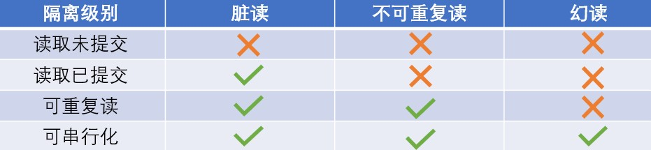

# 事物

## 事物的概念

事物是访问并更新数据库中数据项的一组操作，它们要么都执行，要么都不执行。

可以通过commit提交一个事物，也可以通过rollback来进行回滚

MySQL默认采用自动提交模式。也就是说，如果不显式使用START TRANSACTION语句来开始一个事务，那么每执行一个SQL语句后就会马上执行COMMIT操作。

## 事物的四大特性ACID

* 原子性(Atomicity)：是指数据库事物是不可分割的最小工作单位，只有事物中的所有操作成功，事物才能进行提交。事物中有任何一个SQL语句执行失败，已经执行成功的SQL语句也必须撤销，数据库状态应该回滚到执行事务之前的状态。
* 一致性(Consistency):在事物执行前后，数据库能从一个正确的状态转移到另一个正确的状态。依靠隔离性和原子性实现。
* 隔离性(Isolation)：一个事物在提交前对其他事物是不可见的。即在并发访问数据库时，各并发事物之间数据库是独立的。
* 持久性(Durability)：事物一旦提交，其所做的修改会永远保存到数据库中，即使系统崩溃，数据库也能通过重做日志(Redo log)将数据恢复。

## 事物的实现：
* 用锁来保证事物的一致性
* redo log用来保证事物的原子性和持久性
* undo log用来保证事物的一致性

其中，redo恢复提交事务修改的页操作，而undo回滚行记录到某一个特定的版本。

当事物提交(commit)时,必须先将该事务的所有日志写入到重做日志文件(Redo log)中进行持久化。

在对数据库进行修改时，InnoDB存储引擎不但会产生redo，还会产生一定量的undo。如果用户执行的事物或语句由于某种原因失败了，又或者用户用一条RollBack语句请求回滚，可以利用这些undo信息将数据回滚到修改前的样子。

保存点(Savepoint)用来通知系统应该记住事物当前的状态，以便之后发生错误时，事物能回到保存点当时的状态。注意：rollback to savepoint命令并不真正的结束事物。

## 事物的隔离级别
SQL标准定义了以下四种隔离级别：
* READ UNCOMMITTED（读取未提交）:最低的隔离级别，一个事务所做的修改，即使尚未提交，对其他事务也是可见的。**会导致脏读、幻读或不可重复读**
* READ COMMITTED（读取已提交）：一个事务所做的修改在提交之前对其他事务是不可见的。**可以避免脏读，但不能避免幻读或不可重复读**
* REPEATABLE READ（可重复读）：保证在同一个事务中多次读取同一数据的结果是一样的，除非该数据被这个事务自己所修改。为InnoDB默认的隔离级别。**可以避免脏读和不可重复读，但不能避免幻读**
* SERIALIZABLE（可串行化）：最高的隔离级别，强制事务串行执行，这样多个事务间就不会产生干扰，也就不会出现并发不一致问题（需要加锁实现）。**可以避免脏读、不可重复读和幻读**。

隔离级别越低，事务请求的锁越少或保持锁的时间越短。

虽然InnoDB存储引擎在默认的隔离级别为REPEATABLE READ（可重读）但其在该事务隔离级别下使用的是Next-Key Lock锁算法，因此可以避免幻读的产生，这与其他数据库系统是不同的。所以说InnoDB存储引擎的在默认的隔离级别下已经能完全保证事务的隔离性要求，即达到了SQL标准的SERIALIZABLE(可串行化) 隔离级别。因此，InnoDB 存储引擎默认使用 REPEAaTABLE-READ（可重读） 并不会有任何性能损失。

此外，在使用分布式事务时，InnoDB存储引擎的事务隔离级别必须设置为SERIALIZABLE(可串行化)

## 参考
* 姜承尧. MySQL 技术内幕: InnoDB 存储引擎 第2版[M]. 机械工业出版社, 2013.
* [MySQL锁机制](https://blog.csdn.net/qq_34337272/article/details/80611486)
* [Cyc2018:数据库系统原理](https://github.com/CyC2018/CS-Notes/blob/master/notes/%E6%95%B0%E6%8D%AE%E5%BA%93%E7%B3%BB%E7%BB%9F%E5%8E%9F%E7%90%86.md)
* [JavaGuide；MySQL](https://github.com/Snailclimb/JavaGuide/blob/master/docs/database/MySQL.md#%E9%94%81%E6%9C%BA%E5%88%B6%E4%B8%8Einnodb%E9%94%81%E7%AE%97%E6%B3%95)