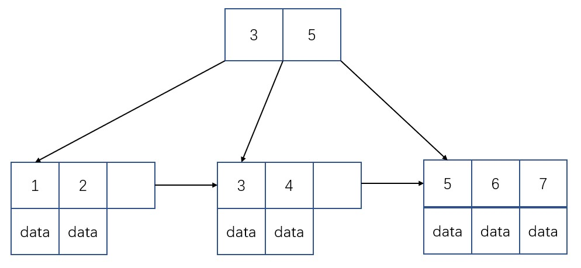

# 索引
索引也叫键，是帮助存储引擎快速找到记录的一种数据结构。相当于一个目录的作用。

索引的优点：
* 加快数据的检索速度
* 通过创建唯一性索引，保证数据库表中每一行数据的唯一性

索引的缺点：
* 创建和维护索引需要耗费时间：当对表中数据进行修改时，如果数据有索引，那么索引也需要修改。
* 占用物存储空间

## B+树
B+树是一颗搜索树，也是平衡树。  
在B+树中，所有记录节点都是按照键值的大小顺序存放在同一层的叶子节点上，由各叶子节点指针进行连接。

在 B+ Tree 中，一个节点中的 key 从左到右非递减排列。如下图所示：如果一个指针的左右相邻的key分别是3和5，则该指针所指向节点的所有key大于等于3小于等于5。

B树与B+树的区别：
* B树的所有节点既存放键(key)也存放数据(data);而B+树只有叶子节点存放key和data，其他内节点只存放key。
* B树的叶子节点都是独立的;B+树的叶子节点有一条指针指向与它相邻的叶子节点。

B+树索引并不能找到一个给定键值的具体行。B+树索引能找到的只是被查找数据行所在的页。然后数据库通过把页读入内存中，再在内存中进行查找，最后得到要查找的数据。

此外，数据库系统将B+树的一个节点的大小设置为页的大小，使得一次 I/O 就能完全载入一个节点。

由于B+树和红黑树相比有更低的树高度。一般B+树的高度都在2-4层，因此查找某一键值的行记录时最多只需要2-4次IO操作。

## B+树索引
B+树索引可以分为聚集索引和辅助索引。
* 二者相同点为：内部结构都为B+树，即高度平衡。叶子节点存放着所有的数据。
* 二者不同点为：​ 聚簇索引的叶子节点就是数据节点，而非聚簇索引的叶子节点仍然是索引节点，只不过有指向对应数据块的指针。
### 1.聚集索引
聚集索引即索引结构和数据一起存放的索引。聚集索引(clustered index)按照每张表的主键构造一棵B+树，同时叶子节点中存放的即为整张表的行数据，也将聚集索引的叶子节点称为数据页。

因为无法把行数据存放在两个不同地方，因此一个表只能有一个聚集索引。

在数据页（叶子节点）上存放的是完整的每行的记录，而在非数据页（非叶子节点）的索引页中，存放的仅仅是键值及指向数据页的偏移量。

### 2.辅助索引
对于辅助索引，叶子节点不包含行记录的数据
。叶子节点data中存储主键值，每次查找数据时，根据索引找到叶子节点中的主键值，根据主键值再到聚集索引中得到完整的一行记录。

即：有以下两步（**回表查询**：先定位主键值，再定位行记录）：
* 先通过普通索引定位到主键值
* 再通过聚集索引定位到行记录

**覆盖索引**：如果where条件的列和返回的数据在一个索引中，那么不需要回查表，那么就叫覆盖索引。

## 哈希索引
哈希索引基于哈希表实现，简单地说就是把键值换算成hashcode，检索时不需要类似B+树那样从根节点到叶子节点逐级查找，只需一次哈希算法即可立刻定位到相应的位置，速度非常快(O(1)时间复杂度）。

但有着如下缺点：
* 哈希索引和B+树索引相比，丧失了有序性。因此无法排序和分组
* 只支持精确查找，无法用于部分查找和范围查找

自适应哈希索引是指：当InnoDB注意到某些索引被使用得很频繁时，会在内存中创键哈希索引，让 B+树 索引也具有哈希索引的一些优点。

## 参考
* 姜承尧. MySQL 技术内幕: InnoDB 存储引擎 第2版[M]. 机械工业出版社, 2013.
* [Cyc2018:MySQL](https://github.com/CyC2018/CS-Notes/blob/master/notes/MySQL.md)
* [JavaGuide:数据库索引总结2](https://github.com/Snailclimb/JavaGuide/blob/master/docs/database/%E6%95%B0%E6%8D%AE%E5%BA%93%E7%B4%A2%E5%BC%95.md)

