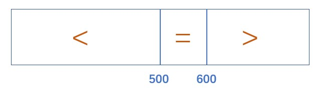

# BFPRT算法

## 算法目的
在无序数组中找到第K小的数，时间复杂度O(N)

## 基于partition思路的算法
和快速排序中partition的思想有些相像。比如说我们要在长度为1000的数组中找到第n小的数，于是我们现在数组中随机找一个数进行partition的过程，小于它的放左边，等于它的放中间，大于它的放右边。完成后的情况如下图所示，等于区域范围为500-600



因为我们要找第n小的数，因此：
* 如果500 < n < 600,因此这个第n小的数就在等于区域，即我们进行partition的基准元素。
* 如果n < 500, 那么这个第n小的数肯定在小于区域，我们继续对小于区域进行partition过程。
* 如果n > 600，那么这个第n小的数肯定在大于区域，我们继续对大于区域进行partition过程。

该算法的平均时间复杂度基于概率，其长期期望为:O(N)

## BFPRT算法
BFPRT算法的时间复杂度不基于概率，严格O(N)

BFPRT与上述算法的唯一区别在于：**选择partition基准元素的这一步不是随机选取的**。一旦选好了这个基准元素，之后的过程和上述算法相同。 

选择基准元素的方式：
1. 先将长度为N的数组进行分组，每5个元素一组
2. 在每一组的组内进行排序(组间不排序)，也即将每一个长度为5的小组排序，小组内排序的时间复杂度为O(1)，一共有N/5个小组，因此这一步的时间复杂度为O(N)
3. 将每一小组的中位数拿出来，构成一个长度为N/5的新数组
4. 递归调用BFPRT算法，找到新数组中的中位数num
5. 将这个元素num作为基准元素，进行partition

为什么要这么选基准元素：  
num在长度为N/5的新数组中是中位数，因此这个新数组中有N/10个数比num大，这N/10个数中的每个数a在它的原数组里又是中位数，即长度为5的原数组中有2个数比a大。因此，所有比num大的数统计起来，至少有$3N/10$个，也即最多有$7N/10$个数比num小.

同理，如果统计比num小的数，发现至少也有$3N/10$个数比它小，即最多有$7N/10$个数比num大.

那么我们用这个num做划分进行partition，会发现最多就有$7N/10$个数比它大，也最多有$7N/10$个数比它小。因此，下一步partition的范围最多也就是$7N/10$。

## 代码
选基准元素的代码部分
```java
//在arr中从begin到end间的元素范围内，选基准元素的过程
public static int medianOfMedians(int[] arr, int begin, int end){
    int num = end - begin + 1;
    int offset = num % 5 == 0 ? 0 : 1;
    //mArr为中位数构成的新数组
    int[] mArr = new int[num / 5 + offset];
    for(int i = 0; i < mArr.length; i++){
        //beginI和endI为每个长度为5的小组的首尾
        int beginI = begin + i * 5;
        int endI = beginI + 4;
        //取出每个小组的中位数，构成新数组
        mArr[i] = getMedian(arr, beginI, Math.min(end, endI));
    }
    //返回新数组的中位数
    return bfprt(mArr, 0, mArr.length - 1, mArr.length / 2);
}

//返回数组arr中从begin到end间所有元素的中位数
public static int getMedian(int[] arr, int begin, int end){
    int[] res = new int[end - begin + 1];
    int index = 0;
    for(int i = begin; i <= end; i++)
        res[index++] = arr[i];
    Arrays.sort(res);
    return res[res.length / 2];
}
```

获得基准元素pivot后，以它为基准进行partition操作，并进入BFPRT流程。
```java
public static int getMinKthByBFPRT(int[] arr, int k){
    int[] copyArr = Arrays.copyOf(arr, arr.length);
    return bfprt(copyArr, 0, copyArr.length - 1, k - 1);
}

//bfprt算法主体，在begin和end间的范围里求第i小的数
public static int bfprt(int[] arr, int begin, int end, int i){
    if(begin == end)
        return arr[begin];
    //求每个小组中位数组成的新数组的中位数
    int pivot = medianOfMedians(arr, begin, end);
    //将pivot作为基准元素进行partition，返回等于区域的范围
    int[] pivotRange = partition(arr, begin, end, pivot);
    if(i >= pivotRange[0] && i <= pivotRange[1])
        return arr[i];
    else if(i < pivotRange[0])
        return bfprt(arr, begin, pivotRange[0] - 1, i);
    else
        return bfprt(arr, pivotRange[1] + 1, end, i);
}

//在数组arr中从begin到end的范围内以pivot为基准元素进行划分，返回等于区域范围
public static int[] partition(int[] arr, int begin, int end, int pivot){
    //用small分别代表小于区域的右边界和大于区域的左边界，初始化时两个区域都没有元素
    int small = begin - 1;
    int big = end + 1;
    int cur = begin;
    while(cur != big){
        if(arr[cur] < pivot)
            swap(arr, ++small, cur++);
        else if(arr[cur] > pivot)
            swap(arr, --big, cur);
        else
            cur++;
    }
    return new int[]{small + 1, big - 1};
}
```