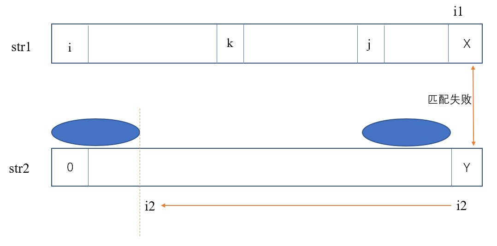

# KMP算法
## KMP算法目的
在str1中寻找str2出现的位置  
假设str1长度为N，str2长度为M  


暴力方法：尝试从str1的每一个位置开始，让str2来匹配，暴力方法时间复杂度：O(MN)

## KMP算法流程：  



* i1代表str1的索引，i2代表str2的索引。二者都从零位置开始尝试匹配。每一次匹配成功，i1和i2都右移
* 当匹配失败时（以图中为例：X != Y)，有一个推论为：在str1从i到j中任何一个位置开始，都匹配不出str2。既然明知匹配不出，那就不用再像暴力法那样从str1中i的下一个位置开始尝试匹配str2。只需从下一个不确定能不能匹配的位置（即j）开始尝试匹配str2。即i1从j开始，i2从0开始。  
又因为str1中从j到x的字符与str2中Y的前next[Y]个字符相等（曾经匹配成功过），str2中Y的前next[Y]个字符与str2的前next[Y]个字符相等（next数组的定义）。因此可以推出：str1中从j到x的字符与str2中Y的前next[Y]个字符相等。  
所以str1中从j开始的next[Y]个字符和str2中从0开始的前next[Y]个字符是肯定相等、不用匹配的。因此i1可以直接从X处开始（匹配失败的位置），i2可以直接从next[Y]处开始。
* 还需注意一个特殊情况：当i2为str2的第一个位置（next[i2] == -1），且str2中i2与str1中i1对应字符不相等时，意味着str2中第一个位置和str1的i1处都不匹配。那么从str1的i1开始肯定匹配不出str2，于是i1++。
* 当while循环退出时，说明str1或str2中的任意一个走到末尾了。如果str2走到末尾了，则说明匹配成功了，返回str2在str1中出现位置的索引：i1-i2。否则，str2没走到末尾str1却走到了末尾，说明匹配失败，str2中没有str1,返回-1。

Q & A  
问：为什么当匹配失败时可以说：在str1中从i到j任何一个位置开始，都匹配不出str2？  
答：假设从str1中i到j的一个位置k开始，可以匹配出str2。即从k到X的这n个字符应该和str2中从0开始的前n个字符匹配（注意：n > next[Y])。又因为str1中k到X的这n个字符已经和str2中Y的前n个字符匹配过了，它们是相等的。于是str2中从0开始的前n个字符（前缀）应该和Y前面的n个字符相等（后缀）。但由next数组的定义可知，它们是不相等的。因此这种假设不成立。

```java
public static int getIndexOf(String s, String m){
    //在s中找不到m，返回-1
    if(s == null || m == null || m.length() < 1 || s.length() < m.length())
        return -1;
    char[] str1 = s.toCharArray();
    char[] str2 = m.toCharArray();
    int i1 = 0;
    int i2 = 0;
    //根据str生成next数组
    int[] next = getNextArray(str2);
    while(i1 < str1.length && i2 < str2.length){
        if(str1[i1] == str2[i2]){
            i1++;
            i2++;
        }
        //next[i2]为1代表i2是str2中的第一个位置，即如果str2中第一个位置和str1的i1位置都不匹配
        //那么让i1加1，让str2和在str1从i1的后一个位置开始匹配
        else if(next[i2] == -1)
            i1++;
        else
            i2 = next[i2];
    }
    return i2 == str2.length ? i1 - i2 : -1;
}
```

## next数组的构建
next数组表示str2中任意一个字符**前面的字符串的最长前缀和最长后缀的匹配长度**

比如：str2为abkababkabF,那么F在next数组中对应的数值就为5（F前面字符串的最长前缀和最长后缀最长匹配5个位置，abkab）

构建next数组的步骤：
例如str2为ababcababaK,那么K前面这个a对应的next值为4（最长前缀和最长后缀abab的长度）。现在已知这个next[a]，想要求next[K],于是我们比较next[a]对应的最长前缀的后一个字符c与next[a]对应的最长后缀的后一个字符a,发现二者不等。于是我们再将这个a与next[c]的最长前缀的后一个字符a相比，发现二者相等。于是next[K] = next[c] + 1,即2+1= 3

注：这里next[K]和next[c]都是简写，实际应该为next[11]和next[5](即位置索引值)

```java
public static int[] getNextArray(char[] str){
    if(str.length == 1)
        return new int[]{-1};
    int[] next = new int[str.length];
    next[0] = -1;
    next[1] = 0;
    //i为当前来到的位置索引
    //cn为i-1对应的最长前缀的下一个字符的位置索引
    //cn可以看作next[i-1]
    int i = 2;
    int cn = 0;
    while(i < next.length){
        if(str[i - 1] == str[cn])
            //相当于next[i]=next[i-1]+1
            next[i++] = ++cn;
        //如果前一个位置的字符与cn处不等，那么cn往前跳
        else if(cn > 0)
            cn = next[cn];
        //如果不等且cn不能往前跳了(其最长前缀和最长后缀为0）
        else
            next[i++] = 0;
    }
    return next;
}
```
