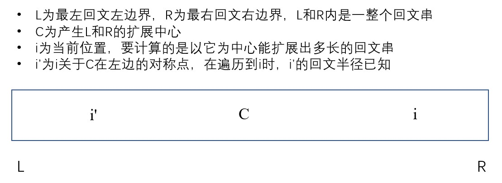

# Manacher算法

## 算法目的
一个字符串中找到最长回文子串

## 暴力方法（中心扩展法）
假设字符串的长度为N，那么回文串可能的中心有2N-1种。其中，每个单字符串都可作为回文串的中心，这种情况有N种。其次，双字符串也可作为回文串的中心，这种情况有N-1种。单字符中心负责扩展成长度为奇数的字符串，双字符串中心可以扩展成长度为偶数的字符串。例如：

* 字符串“aba”有5种可能的中心：a、b、c、ab、ba  
* 字符串“abba”有7种可能的中心：a、b、b、a、ab、bb、ba
  
中心扩展法的基本思想为：对于每一个中心都计算一次以其为中心的最长回文串长度

具体算法：对于每一个可能的回文中心，都尽可能地扩展它对应的回文区间[left, right]，直到left=N或者S[left]不等于S[right]为止

```java
public String longestPalindrome(String s) {
    int len = s.length();
    String res = "";
    for (int i = 0; i < len * 2 - 1; i++) {
        int left = i / 2;
        int right = left + i % 2;
        while (left >= 0 && right < len && s.charAt(left) == s.charAt(right)) {
            String tmp = s.substring(left, right + 1);
            if (tmp.length() > res.length()) {
                res = tmp;
            }
            left--;
            right++;
        }
    }
    return res;
}
```

* 时间复杂度：O(n^2)

## Manacher算法

一些概念：
* 回文半径数组：记录以每一个位置为中心的回文半径的长度
* 最右回文右边界：所有位置对应的回文半径中最靠右的位置
* 回文右边界的中心：得到最右回文右边界的回文半径的回文中心是哪里（由哪个中心向右扩展得到最右回文右边界）

在回文右边界和回文左边界中的字符串是回文串。假设最右回文右边界R的中心是c，当前位置i关于c在其左边的对称位置为i'。



算法步骤：  
分析四种情况
1. i在R外，用暴力法扩展。
2. i在R里，i'的回文半径整体彻底在L（回文左边界）和R的内部，那么以i为中心的回文半径等于以i'为中心的回文半径
3. i在R里，i'的回文半径在L和R的外面，那么以i为中心的回文半径等于i到R的距离
4. i在R里，i'的回文左边界和L压线，那么要将i'的回文半径继续向外扩展（i到R的区域肯定在i的回文半径里，不需扩展。R右边是否在i的回文半径里还不清楚，需要扩展才知道)

上面四种情况中，需要扩展的只有情况1和情况4，对于情况2和情况3，以i为中心的回文半径可以用O(1)的时间开销直接得出。而情况1和情况4在扩展时，R不断向右扩。只要进行一次成功的扩展，R都必然会增加。也就是说R最多就是从0位置到n位置（n为字符串长度)且R不会回退，所以***整个Manacher算法的时间复杂度为O(N)***

```java
//给定一个字符串，返回它的最长回文字串长度
public static int manacher(String str) {
    if (str == null || str.length() == 0) {
        return 0;
    }
    //将字符串扩展为manacher字符串（每个字符中间和字符串前后加#)
    //因为扩展后字符串长度翻倍，因此求扩展后的字符串的最大回文半径，即求原来字符串的最大回文直径
    char[] charArr = manacherString(str);
    //pArr为回文半径数组
    int[] pArr = new int[charArr.length];
    int C = -1;
    int R = -1;
    //max记录最长的回文半径长度
    int max = Integer.MIN_VALUE;
    for (int i = 0; i != charArr.length; i++) {
        //i在R里时：对于情况2和3，在i'的回文半径和i与R的距离中取较小值，即为i的回文半径
                 //对于情况4，先将回文半径设为R-i，再在之后while循环中将回文半径继续向外扩展
        //i在R外时，先将i位置的回文半径置为1，之后再在while循环里扩展
        pArr[i] = R > i ? Math.min(pArr[2 * C - i], R - i) : 1;
        //情况2和情况3即使进入了该while循环，但是第一次if都不会成立，会直接break退出循环
        //只有情况1和情况4会在while循环里进行回文半径的扩展。
        while (i + pArr[i] < charArr.length && i - pArr[i] > -1) {
            if (charArr[i + pArr[i]] == charArr[i - pArr[i]])
                pArr[i]++;
            else {
                break;
            }
        }
        //更新最大回文右边界R和其对应的回文中心C
        if (i + pArr[i] > R) {
            R = i + pArr[i];
            C = i;
        }
        //更新max
        max = Math.max(max, pArr[i]);
    }
    return max - 1;
}

//生成manacher字符串，将给定字符串str的两端和每个字符中间全加上特殊符号#
public static char[] manacherString(String str) {
    char[] charArr = str.toCharArray();
    char[] res = new char[str.length() * 2 + 1];
    int C = 0;
    for (int i = 0; i != res.length; i++) {
        res[i] = (i & 1) == 0 ? '#' : charArr[C++];
    }
    return res;
}
```