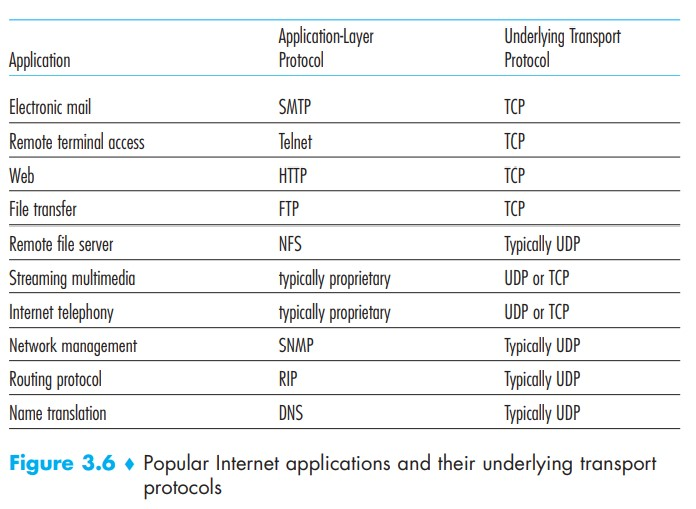
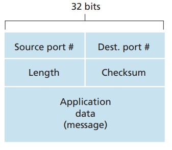
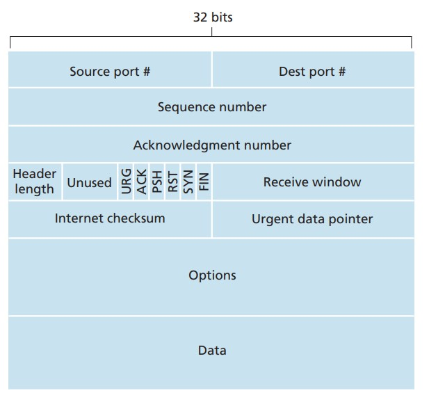
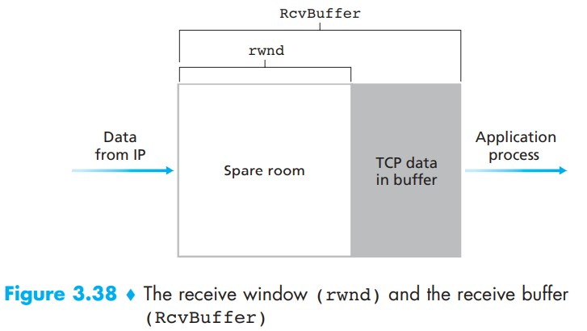
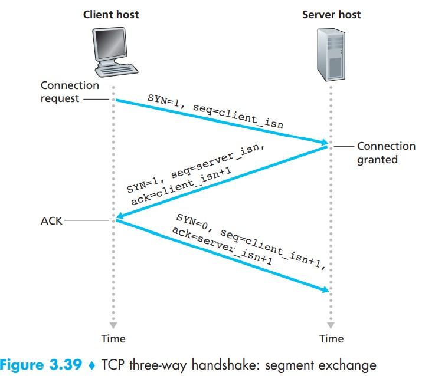
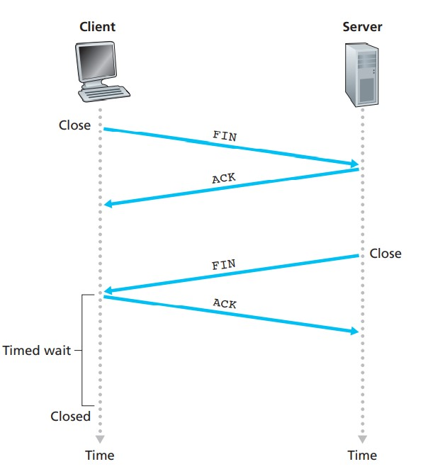
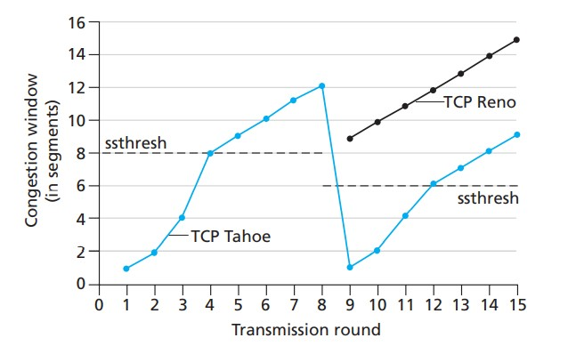

# 传输层

## 1.概述
网络层只把分组发送到目的主机，但是真正通信的并不是主机而是主机中的进程。传输层提供了进程间的逻辑通信，传输层向高层用户屏蔽了下面网络层的核心细节，使应用程序看起来像是在两个传输层实体之间有一条端到端的逻辑通信信道。

传输层包括以下两个协议：
* ***TCP（Transmission Control Protocol）***:TCP是面向连接的，提供可靠交付，有流量控制，拥塞控制，提供全双工通信，面向字节流（把应用层传下来的报文看成字节流，把字节流组织成大小不等的数据块），每一条 TCP 连接只能是点对点的（一对一）。
* ***UDP（User Datagram Protocol）***:UDP是无连接的，尽最大可能交付，没有拥塞控制，面向报文（对于应用程序传下来的报文不合并也不拆分，只是添加 UDP 首部），支持一对一、一对多、多对一和多对多的交互通信。

## 2. UDP
UDP从应用程序进程的得到数据，附加上用于多路复用/分解复用的源和目的端口号字段，以及两个其他的小字段，然后将形成的报文段交给网络层。

注意：使用UDP时，在发送报文段之前，发送方和接收方的传输层实体之间没有握手，因此UDP被称为是无连接的（DNS协议就是基于UDP的）

使用UDP的几个好处：
* 因为实时应用通常要求最小的发送速率，不希望过分延迟报文段的传送，且能容忍一些数据丢失，这种情况用TCP就不太合适。
* 无需连接建立：UDP无需任何准备即可进行数据传输。因此，UDP不会引入建立连接的时延，这也是DNS使用UDP的原因。
* 无连接状态：TCP不仅要在端系统中维护连接状态，而且还要跟踪包括接收和发送缓存、拥塞控制参数以及序号与端口号的参数。而UDP不维护连接状态，也不跟踪这些参数。因此某些专门用于某种特定应用的服务器当应用程序运行在UDP之上时，一般都能支持更多的活跃用户。
* 分组首部开销小：UDP首部只有8字节的首部开销。而TCP首部则有20字节的首部开销。

用UDP进行可靠数据传输的方法：  
在应用程序自身中建立可靠性机制。这样的话，应用程序进程一方面可以进行可靠通信，另一方面也而无需受制由于TCP的拥塞控制带来的传输速率的限制。

TCP首部字段只有 8 个字节，包括源端口、目的端口、长度、检验和（每个占2字节）。其中，长度指整个UDP报文段所占的字节数（首部+数据）

 

注意：尽管UDP提供了差错检测，但它并没有提供恢复错误的机制。

## 3. TCP
TCP被称为是面向连接的，这是因为在两个进程互相发送数据之前，两个进程必须先相互握手。

### 3.1 TCP报文段格式

* 序号(Sequence number)：一个报文段的序号是这个报文段的data字段的第一个字节的序号，例如序号为 301，表示第一个字节的编号为 301，如果携带的数据长度为 100 字节，那么下一个报文段的序号应为 401。
* 确认号(Acknowledgement number)：期望收到的下一个报文段的序号。例如 B 正确收到 A 发送来的一个报文段，序号为 501，携带的数据长度为 200 字节，因此 B 期望下一个报文段的序号为 701，B 发送给 A 的确认报文段中确认号就为 701。
* 确认 ACK ：当 ACK=1 时确认号字段有效，否则无效。TCP 规定，在连接建立后所有传送的报文段都必须把 ACK 置 1。
* 同步 SYN ：在连接建立时用来同步序号。当 SYN=1，ACK=0 时表示这是一个连接请求报文段。若对方同意建立连接，则响应报文中 SYN=1，ACK=1。
* 终止 FIN ：用来释放一个连接，当 FIN=1 时，表示此报文段的发送方的数据已发送完毕，并要求释放连接。
* 窗口(Receive window)：窗口值作为接收方让发送方设置其发送窗口的依据。之所以要有这个限制，是因为接收方的数据缓存空间是有限的。

### 3.2 TCP的流量控制(Flow Control)
TCP为应用进程提供了流量控制服务，以消除发送方使接收方缓存溢出的可能性。流量控制服务是一个速度匹配服务，即让发送方发送的速率与接收方应用进程的读取速率相匹配，保证接收方来得及接收。而TCP发送方也可能因为IP网络的拥塞而被遏制，因为这种情况而对发送方的控制则是拥塞控制。

TCP通过让发送方维护一个称为接收窗口(receive window)的变量来提供流量控制，这个接收窗口用于告知发送方：该接收方还有多少可用的缓存空间。

由于TCP不允许已分配的缓存溢出，所以下式必须成立（不等式左边代表仍处在缓存中的数据量）：  

LastByteRcvd - LastByteRead <= RcvBuffer

接收窗口用rwnd表示，根据缓存空间的可用大小来设置：

rwnd = RcvBuffer - (LastByteRcvd - LastByteRead)

由于该空间是随着时间变化的，所以rwnd是不断滑动的。

连接通过rwnd来提供流量控制的方式：主机B通过把当前的rwnd值放入它发给主机A的报文段接收窗口字段(reveive window)中，通知主机A它在该连接的缓存中还有多少可用空间。

而主机A也不断跟踪两个变量，LastByteSent和LastByteAcked,二者的差即是主机A发送到连接中但未被确认的数据量，通过将这个量控制在rwnd内，就可以保证主机A不会使主机B的缓存溢出。因此主机A必须始终保证：  

LastByteSent - LastByteAcked <= rwnd

注意：因为TCP仅当在它有数据或有ACK要发时才会发送报文段给A。因此当B的rwnd为0并且通知给A后，B不再向A发送带有rwnd的新报文段，即使之后B中rwnd不为0了，A也不会知道。所以TCP规范中要求：当主机B的接收窗口为0时，主机A继续发送只有一个字节数据的报文段，这样B就能不断地回复A以ACK报文段，并向A通知rwnd状态。

### 3.3 TCP的三次握手
TCP的三次握手发生在连接建立时

假设 A 为客户端，B 为服务器端。  
* 首先 B 处于 LISTEN（监听）状态，等待客户的连接请求。
* A 向 B 发送连接请求报文，SYN=1，ACK=0，选择一个初始的序号 x。
* B 收到连接请求报文，如果同意建立连接，则向 A 发送连接确认报文，SYN=1，ACK=1，确认号为 x+1，同时也选择一个初始的序号 y。
* A 收到 B 的连接确认报文后，还要向 B 发出确认，确认号为 y+1，序号为 x+1。并且SYN被置0.
* B 收到 A 的确认后，连接建立。在以后的报文段中，由于连接已建立，SYN都将是0.

***三次握手的原因***  
第三次握手是为了防止失效的连接请求到达服务器，让服务器错误打开连接。

客户端发送的连接请求如果在网络中滞留，那么就会隔很长一段时间才能收到服务器端发回的连接确认。客户端等待一个超时重传时间之后，就会重新请求连接。但是这个滞留的连接请求最后还是会到达服务器，如果不进行三次握手，那么服务器就会打开两个连接。如果有第三次握手，客户端会忽略服务器之后发送的对滞留连接请求的连接确认，不进行第三次握手，因此就不会再次打开连接。

### 3.4 TCP的四次握手
TCP的三次握手发生在连接释放时
* A 发送连接释放报文，FIN=1。
* B 收到之后发出确认报文段，此时 TCP 属于半关闭状态，B 能向 A 发送数据但是 A 不能向 B 发送数据。
* 当 B 不再需要连接时，发送连接释放报文，FIN=1。
* A 收到后发出确认，进入 TIME-WAIT 状态，等待 2 MSL（最大报文存活时间）后释放连接。
* B 收到 A 的确认后释放连接。

***四次挥手的原因***  
客户端发送了 FIN 连接释放报文之后，服务器收到了这个报文，就进入了 CLOSE-WAIT 状态。这个状态是为了让服务器端发送还未传送完毕的数据，传送完毕之后，服务器会发送 FIN 连接释放报文。

***TIME_WAIT***  
客户端接收到服务器端的 FIN 报文后进入此状态，此时并不是直接进入 CLOSED 状态，还需要等待一个时间计时器设置的时间 2MSL。这么做有两个理由：
* 确保最后一个确认报文能够到达。如果 B 没收到 A 发送来的确认报文，那么就会重新发送连接释放请求报文，A 等待一段时间就是为了处理这种情况的发生。
* 等待一段时间是为了让本连接持续时间内所产生的所有报文都从网络中消失，使得下一个新的连接不会出现旧的连接请求报文。

TIME_WAIT结束之后，连接就正式关闭，客户端所有资源将被释放。

### 3.5 TCP拥塞控制
如果网络出现拥塞，分组将会丢失，此时发送方会继续重传，从而导致网络拥塞程度更高。因此当出现拥塞时，应当控制发送方的速率。这一点和流量控制很像，但是出发点不同。流量控制是为了让接收方能来得及接收，而拥塞控制是为了降低整个网络的拥塞程度。

***TCP如何限制发送速率***  
运行在发送方的TCP拥塞控制机制跟踪一个称为拥塞窗口的变量，记为cwnd。它对一个TCP发送方能像网络中发送流量的速率进行限制。即，在一个发送方中未被确认的数据量不会超过cwnd和rwnd中的最小值，即：

LastByteSent - LastByteAcked <= min{cwnd, rwnd}

以上约束限制了发送方中未被确认的数据量，因此间接地限制了发送方的发送速率。

***TCP如何察觉拥塞***  
当出现过度的拥塞时，在沿着这条路径上的一台或多台路由器的缓存会溢出，引起一个数据报被丢弃，丢弃的数据报接着会引起发送方的丢包事件（要么超时要么收到3个冗余ACK），发送方就认为在发送方到达接收方的路径上出现了拥塞。

TCP通过慢启动、拥塞避免和快速恢复这三个部分来实现拥塞控制。

* 慢启动：发送的最初执行慢启动，令 cwnd = 1，发送方只能发送 1 个报文段；当收到确认后，将cwnd 加倍，因此之后发送方能够发送的报文段数量为：2、4、8 ...
* 拥塞避免：注意到慢开始每个轮次都将 cwnd 加倍，这样会让 cwnd 增长速度非常快，从而使得发送方发送的速度增长速度过快，网络拥塞的可能性也就更高。设置一个慢开始门限 ssthresh，当 cwnd >= ssthresh 时，进入拥塞避免，每个轮次只将 cwnd 加 1。
* 快速恢复：当丢包事件发生时，cwnd的值被设置成1个MSS，并且ssthresh的值设置为cwnd的一半，然后重新执行慢启动。

上图中传输轮次1-4为慢启动过程，5-8为拥塞避免过程，之后为快速恢复过程。
