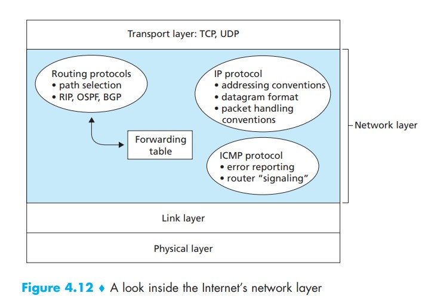
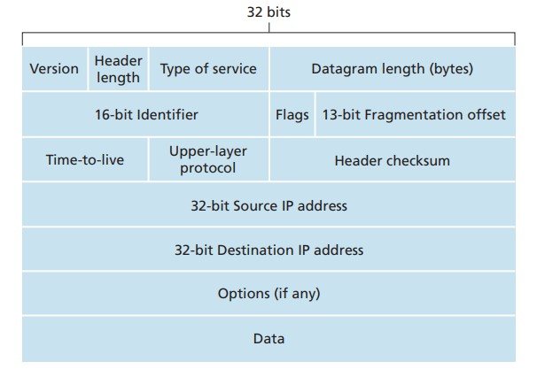
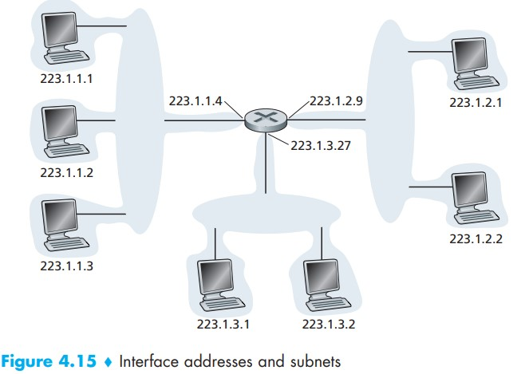
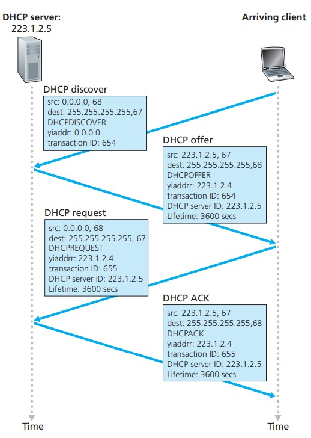
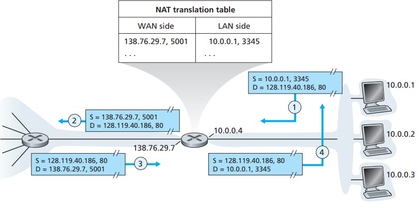
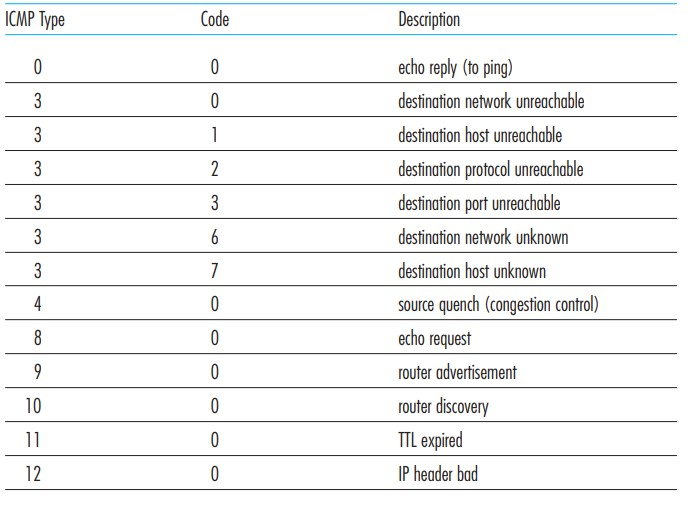
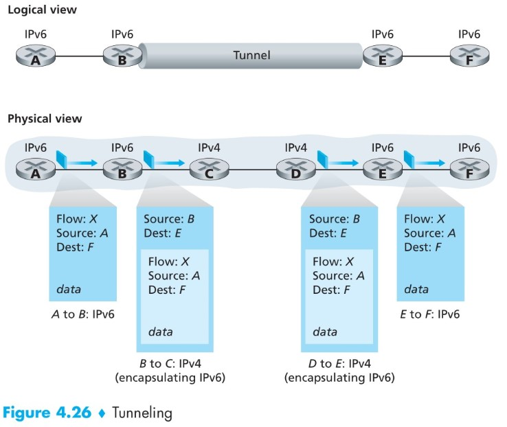

# 网络层

## 1.概述

网络层分为数据平面和控制平面。  
* 数据平面的作用是在一个路由器中，将数据报从一个输入链路转移到一个适当的输出链路，即转发功能(forward)
* 控制平面的作用是协调一个网络中的每个路由器的转发动作，使得数据报沿着源和目的地主机之间的路由器路径最终进行端到端传送，即路由功能(routing)

链路层交换机和路由器的区别：
* 链路层交换机基于链路层帧中的字段值做出转发决定，交换机因此被称为链路层设备。
* 路由器基于网络层数据报中的首部字段做出转发决定，路由器因此被称为网络层设备

当一个数据报从源被传送到目的地主机时，它通过了一些列的路由器。每个路由器都是用这个数据报的目的地地址来转发包。即，每个路由器都有一个转发表，其将目的地的IP地址与一个输出链路接口相对应。当一个数据报到达路由器时，路由器使用数据高的目的Ip地址在转发表中找到一个合适的输出链路接口(output link interface)

网络层协议概览：

## 2.IP协议(Internet Protocol)

### 2.1 IP数据报格式：

* header length：由于IPv4数据报中包含一些可变数量的选项(options),因此需要首部长度字段用来确定IP数据报中载荷从何处开始。大多数IP数据报不包含(option),所以***一般的IP数据报具有20字节的首部***。
* TTL(Time-to-live):该字段用来确保数据报不会永远在网络中循环。每当一个路由器处理数据包时，该字段就减1.若TTL字段减为0，则该数据报被丢弃。
* Protocol：该字段只有当一个IP数据报到达其最终目的地时才会有用，其指示了IP数据报的数据部分应该交给哪个特定的传输层协议。例如：值为6表明要将data交给TCP，值为17表明要将data交给UDP。这里Protoclo字段所起到的作用，类似于传输层报文段中的端口号的作用。***协议号是将网络层与传输层绑定在一起的粘合剂，而端口号是将传输层与应用层绑定在一起的粘合剂***
* 首部检验和：路由器对收到的每个IP数据报计算其首部检验和，如果数据报首部中携带的检验和，与计算得到的检验和不一致，则检测出error，路由器一般会丢掉检测出error的数据报。

### 2.2 IP编址
主机和物理链路之间的边界叫接口。IP要求每台主机和路由器接口拥有自己的IP地址。因此一个IP地址与一个接口相关联，而不是与包括该接口的主机或路由器相关联。

每个IP地址长度为32比特（4字节），这些地址通常按所谓点分十进制记法表示，即地址中的每个字节用它的十进制形式书写，各字节间以句点隔开。

如图所示，在这个例子中，互联左上方的三个主机接口和一个路由器接口的网络形成一个子网。IP编址为这个子网分配一个地址223.1.1.0/24。其中的“/24”记法，称为子网掩码（subnet mask），指示32比特中的最左侧24比特定义了子网地址。一个子网中的所有设备拥有共同的子网地址。

形式为a.b.c.d/x的地址的x最高比特构成了IP地址的网络部分，并且经常被称为该地址的前缀。一个组织通常被分配一块连续的地址，即具有相同前缀的一段地址。当该组织外部的一台路由器转发一个数据报，且该数据报的目的地址位于该组值的内部时，仅需要考虑该地址前面的x比特，这相当大地减少了在这些路由器中转发表的长度。

一个地址的剩余32-x比特可认为是用于区分该组织内部设备的，其中的所有设备具有相同的网络前缀。当该组织内部的路由器转发分组时，才会考虑这些比特。

IP广播地址是255.255.255.255。当一个主机发出一个目的地址为255.255.255.255的数据报时，该报文会交付给同一个网络中的所有主机。

## 3. DHCP协议
DHCP(Dynamic Host Configuration Protocal)协议允许主机自动获取一个IP地址。网络管理员能够配置DHCP，以使某给定主机每次与网络连接时能得到一个相同的IP地址，或者某主机将被分配一个临时的IP地址，每次与网络连接时该地址也许是不同的。同时，DHCP还允许一台主机得知其他的一些信息，例如子网掩码、第一条路由器地址（默认网关）与它的本地DNS服务器的地址。

DHCP适合这样的情况：许多用户来来往往，并且只在有限的时间内需要地址。

每个子网一般都将具有一台DHCP服务器。如果在子网中没有服务器，则需要一个DHCP中继代理，这个代理知道用于该网络的DHCP服务器的地址。

DHCP协议的四个步骤（yiaddr:your Internet adress)：    

* **DHCP服务器发现**：一台新到达的主机的首要任务是发现一个要与其交互的DHCP服务器。这可以通过广播DHCP发现报文(DHCP discover message)来完成，客户在UDP分组中向端口67发送该发现报文。
* **DHCP服务器提供**：当DHCP服务器收到一个DHCP发现报文时，用DHCP提供报文（DHCP offer message）向客户做出响应，该报文向该子网中的所有节点广播，仍然使用广播地址255.255.255.255。每台DHCP服务器提供的报文含有收到的发现报文的事务ID、向客户推荐的IP地址、网络掩码以及IP地址租用期（即IP地址有效的时间量）
* **DHCP请求**：新到达的客户从一个或多个服务器offer中选择一个，并向选中的服务器offer用DHCP请求报文（DHCP request message）进行响应，并回显配置的参数。
* **DHCP ACK**：服务器使用DHCP ACK报文（DHCP ACK message）对DHCP请求报文进行响应，证实所要求的参数。

## 4.网络地址转换（NAT）
NAT用于如下图所示的家庭网络等专用网络或具有专用地址的地域，一个具有专用地址的地域是指其地址仅对该网络中的设备有意义的网络。

NAT路由器对于外部设备来说甚至不像一台路由器，相反它对外界的行为就像一个具有单一IP地址的设备。在图中，所有离开家庭路由器流向更大的因特网的报文都拥有一个源地址138.76.29.7,且所有进入家庭的报文都拥有一个目的地址138.76.29.7。NAT路由器对外界隐藏了家庭网络内的细节。

路由器从ISP的DHCP服务器得到它的地址，并且路由器运行一个DHCP服务器，为位于NAT-DHCP路由器控制的家庭网络地址空间的计算机提供地址。

例如：主机10.0.0.1指派了源端口号3345并将该数据报发送到LAN中，NAT路由器收到该数据报，为其生成一个新的源端口号5001，将源IP地址替代为其WAN一侧接口的IP地址138.76.29.7，且将源端口3345更换为新端口5001.
当报文到达NAT路由器时，路由器使用目的地址的IP地址与目的端口号从NAT转发表中检索出家庭网络浏览器使用的相应IP地址。于是，路由器重写该数据报的目的地址和目的端口号，并向家庭网络转发该数据报。

注：如果一个主机在NAT后面，那么它无法作为一个服务器接受TCP连接请求。

## 5.ICMP（Internet Control Message Protocol)
主机和路由器用ICMP来彼此沟通网络层的信息。ICMP最典型的用途是差错报告。ICMP报文是承载在IP分组中的，因此从体系结构上讲它是位于IP之上的，但是它仍然被认为是网络层的协议而不是更高层的协议。当一台主机收到一个指明上层协议为ICMP的IP数据报时，它分解出该数据报的内容给ICMP，就像分解出一个数据报的内容给TCP或UDP一样。

ICMP报文有一个类型字段和一个编码字段，并且包含引起该ICMP报文首次生成的IP数据报的首部和前8字节内容（以便发送方能确定引发该差错的数据报）  
ICMP报文类型如下：

以下为两个ICMP的应用：
### Ping
Ping 是 ICMP 的一个重要应用，主要用来测试两台主机之间的连通性。

Ping 的原理是通过向目的主机发送 ICMP Echo （Type类型为8，code类型为0）请求报文，目的主机收到之后会发送 Echo 回答报文。Ping 会根据时间和成功响应的次数估算出数据包往返时间以及丢包率。

### Traceroute
Traceroute 是 ICMP 的另一个应用，用来跟踪一个分组从源点到终点的路径。

Traceroute 发送的 IP 数据报封装的是无法交付的 UDP 报文段，并由目的主机发送终点不可达ICMP差错报告报文。

* 源主机向目的主机发送一连串的 IP 数据报。第一个数据报 P1 的生存时间 TTL 设置为 1，当 P1 到达路径上的第一个路由器 R1 时，R1 收下它并把 TTL 减 1，此时 TTL 等于 0，R1 就把 P1 丢弃，并向源主机发送一个 ICMP 时间超过差错报告报文；
* 源主机接着发送第二个数据报 P2，并把 TTL 设置为 2。P2 先到达 R1，R1 收下后把 TTL 减 1 再转发给 R2，R2 收下后也把 TTL 减 1，由于此时 TTL 等于 0，R2 就丢弃 P2，并向源主机发送一个 ICMP 时间超过差错报文。
* 不断执行这样的步骤，直到最后一个数据报刚刚到达目的主机，主机不转发数据报，也不把 TTL 值减 1。但是因为数据报封装的是无法交付的 UDP，因此目的主机要向源主机发送 ICMP 终点不可达差错报告报文（Type3 code3）。
* 之后源主机知道了到达目的主机所经过的路由器 IP 地址以及到达每个路由器的往返时间。

## 6.IPv6
为了解决IPv4地址不够用的问题，IPv6将IP地址长度从32比特增加到128比特，且IPv6数据报的首部被固定为40字节。IPv6也不允许在中间路由器上进行分片和重新组装，这种操作只能在源和目的地上执行。

### IPv4向IPv6的过渡：
IPv4向IPv6的过渡有两种方式，分别为双栈方法（dual-stack）和使用隧道（tunneling）

***双栈方法***：  
使用双栈方法的IPv6节点具有完整的IPv4实现，它具有发送和接受IPv4和IPv6两种数据报的能力。但是这种方法有一个缺点：如下图所示：如果不适用隧道的话，即使E和F之间能交换IPv5数据报，但从D到E的IPv4数据报中并不含有从A发出的初始IPv6数据报中的所有字段。因此E和F之间也只能交换IPv4.

***使用隧道***：  

我们将两台IPv6路由器之间中间IPv4路由器的集合称为一个隧道(tunnel),借助于隧道，在隧道发送端的IPv6节点（如B）可将整个IPv6数据报放到一个IPv4数据报的数据(data)字段中。于是，该IPv4数据报的地址设为指向隧道接受端的IPv6节点(如E)。

在隧道接受端的IPv6节点最终收到该IPv4数据报，并确定该IPv4数据报含有一个IPv6数据报，于是从中取出IPv6数据报，再为该IPv6数据报提供路由，就好像它是从一个直接相连的IPv6邻居那里接收到该IPv6数据的一样。

## 7.路由选择算法
路由选择算法的目的：给定一组路由器以及连接路由器的链路，路由选择算法要找到一条从源路由器到目的路由器的最好路径。

其分为两类；
* 全局式路由选择算法：用完整的、全局的网络信息计算出从源到目的地之间的最低费用路径。具有这种全局信息的算法常被称作**链路状态(link state,LS)算法**
* 分散式路由选择算法： 没有节点拥有关于所有网络链路费用的完整信息，每个节点仅有与其直接相连链路的费用信息便可开始计算。常被称作**距离向量(distance-vector,DV)算法**

路由选择协议都是自适应的，能随着网络通信量和拓扑结构的变化而自适应地进行调整。

互联网可以划分为许多较小的自治系统 AS，一个 AS 可以使用一种和别的 AS 不同的路由选择协议。在一个AS内部，所有路由器运行同样的自治系统内部路由选择协议。在各AS之间，AS运行相同的AS间路由选择协议。

可以把路由选择协议划分为两大类：
* 自治系统内部的路由选择：RIP 和 OSPF
* 自治系统间的路由选择：BGP
