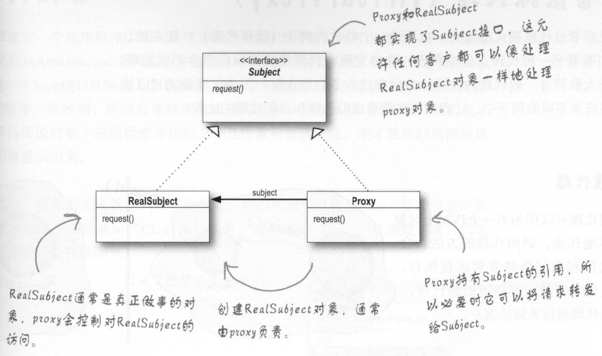
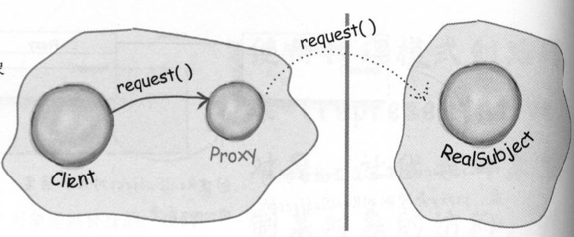
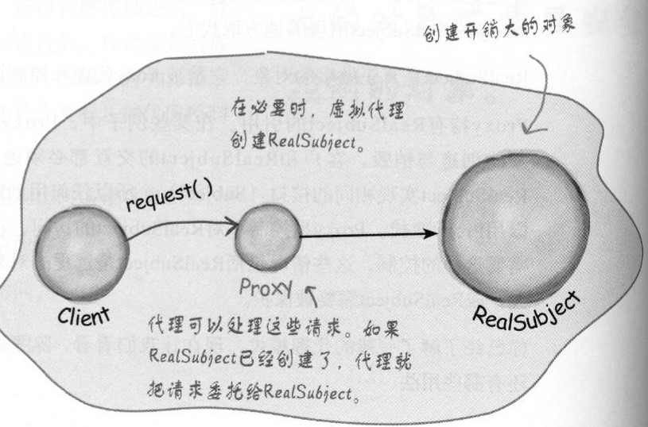

# 代理模式

## 定义
**一句话描述：控制对其他对象的访问**

代理模式创建代理(Pxory)，让代理控制某对象的访问，被代理的对象可以是远程的对象、创建开销大的对象或需要安全控制的对象。



RealSubject和Pxory都实现了Subject接口，因此Pxory可以在RealSubject出现的地方取代它。

代理模式有以下几个代表：
* 远程代理：控制访问远程对象
* 虚拟代理：控制访问创建开销大的资源
* 保护代理：基于权限控制对资源的访问

## 远程代理：

如果我们要访问的对象在另一个JVM堆中（即在不同的地址空间中运行的远程对象），我们就没办法通过引用来得到这个对象。

    注：Subject a = XXX
    对于这种语句，a只能引用与当前代码语句所在同一个堆空间的对象。

对于这种情况，远程代理就可以作为另一个JVM上对象的本地代表。调用代理的方法会被代理利用网络转发给远程执行，并且结果会通过网络返回给代理，再由代理将结果转给客户。

## 保护代理
保护代理根据访问权限决定客户是否可以访问对象。

例如：有一个雇员对象，保护代理允许一个雇员自己调用对象上的某些方法（如setName()),但不允许雇员自己调用类似于setSalary()的方法。  
而保护代理允许经理调用setSalary()方法，但不允许经理调用setName()方法。


## 虚拟代理：
虚拟代理作为创建开销大的对象的代表。虚拟代理在我们真正需要使用一个对象时才创建这个对象。当对象在创建前和创建中时，由虚拟代理来扮演对象的替身。当对象创建后，代理就会将请求直接委托给对象。



### 以下为虚拟代理的实现：  

**背景说明**：当加载一张图片时，限于连接带宽和网络负载，加载可能需要一些时间，所以在等待图像加载的时候，应该显示一些东西。（同时也不希望在显示这些东西时整个应用被挂起）一旦图像被加载完成后，刚才显示的东西应该消失，图像显示出来。

先定义一个接口Image，代理和真正的图片对象都要实现Image接口
```java
public interface Image{
    void showImage();
}
```

代理类：
```java
public class ImagePxory implements Image {
    private RealImage realImage;
    public ImagePxory(RealImage realImage){
        this.realImage = realImage;
    }
    @Override
    public void showImage(){
        //当realImage加载完成时，显示realImage
        //否则显示:Image is loading, please wait
        while(!realImage.isLoad()){
            try{
                System.out.println(("Image is loading, please wait"));
                Thread.sleep(100);
            }
            catch(InterruptedException e){
                e.printStackTrace();;
            }
        }
        realImage.showImage();
    }
}
```

真实图片类：
```java
public class RealImage implements Image {
    private URL imageURL;
    private int height;
    private int width;
    private long startTime;

    public RealImage(URL imageURL){
        this.imageURL = imageURL;
        this.height = 500;
        this.height = 500;
        this.startTime = System.currentTimeMillis();
    }
    //模拟图片加载过程，假定图片加载需要三秒
    public boolean isLoad(){
        long endTime = System.currentTimeMillis();
        return endTime - startTime > 3000;
    }
    @Override
    public void showImage(){
        System.out.println(imageURL);
    }
}
```

客户端代码：
```java
public static void main(String[] args) throws Exception{
    String image = "http://image.jpg";
    URL url = new URL(image);
    RealImage realImage = new RealImage(url);
    ImagePxory imagePxory = new ImagePxory(realImage);
    imagePxory.showImage();
}
```

## 参考
* 弗里曼. Head First 设计模式 [M]. 中国电力出版社, 2007.
* [CyC2018: CS-Notes:设计模式](https://github.com/CyC2018/CS-Notes/blob/master/notes/%E8%AE%BE%E8%AE%A1%E6%A8%A1%E5%BC%8F%20-%20%E7%9B%AE%E5%BD%95.md)

