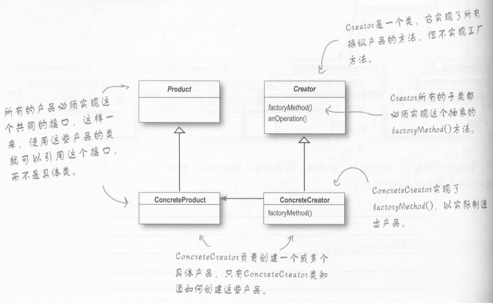

# 工厂模式
工厂模式分为三种，分别为：
* 简单工厂模式
* 工厂方法模式
* 抽象工厂模式

接下来以pizza店的例子阐述三种模式
## 简单工厂模式
**一句话描述：简单工厂模式将对象的创建封装了起来**

通过工厂类创建对象，并且根据传入参数决定具体要实例化哪种子类对象的做法，叫简单工厂模式(Simpe Factory Pattern)
以下代码描述了产品类，包括一个抽象接口和两个具体类
```java
//Pizza类为接口，description方法由具体的pizza类实现
public interface Pizza{
    void description();
}
//有两种pizza类实现了上面的接口
public class CheesePizza implements Pizza{
    @Override
    public void description() {
        System.out.println("I am cheesepizza");
    }
}
public class VeggiePizza implements Pizza{
    @Override
    public void description(){
        System.out.println("I am veggiePizza");
    }
}
```
接下来我们构建一个pizza工厂专门负责构造pizza对象。从而把本应在PizzaStore中构造并初始化pizza对象的代码迁移到pizza工厂类的创建方法createPizza中：
```java
//pizza工厂类。这个类只做一件事：帮客户创建pizza
public class SimplePizzaFactory{
    //在创建方法中传入参数type，根据参数来判断要创建哪种pizza对象
    public Pizza createPizza(String type){
        Pizza pizza = null;
        if(type.equals("cheese"))
            pizza = new CheesePizza();
        else if(type.equals("veggie"))
            pizza = new VeggiePizza();
        return pizza;
    }
}
```
因此，在客户端（也就是PizzaStore类）中，想要创建哪种对象，只需传入对应的名称即可。
```java
public class PizzaStore{
    public Pizza orderPizza(String type){
        //先创建一个工厂对象factory
        SimplePizzaFactory factory = new SimplePizzaFactory();
        //再利用工厂factory创建与type相对应的工厂对象
        Pizza pizza = factory.createPizza(type);
        pizza.cook();
        return pizza;
    }
    //其他方法（均可以调用createPizza方法创建pizza对象）
}
```
通过简单工厂模式，我们可以把客户类和具体子类的实例化解耦，客户端不再需要用众多if else语句根据type判断自己应该实例化哪个子类。现在客户端只需要用将type传入工厂类中的创建方法，即可在在这个方法的返回值中得到想要的对象。

这样做有什么好处呢？   
>设想如果未使用简单工厂模式，在客户端用if else判断并实例化产品对象。当我们有多个客户端的时候，这些客户端就都需要知道产品的细节（即有哪些产品以及需要构建哪种产品对象）。而且如果我们多增加一项产品，那么这么多客户端都需要进行修改（再增加一条if else语句）

简单工厂模式的缺陷：  
>即使使用了简单工厂模式，当我们多增加一项产品时，还是要在工厂类的构建方法中增加一条if else语句。这样就不符合"对扩展开放，对修改封闭"的OO原则。

因此就引入了工厂方法模式，我们将在这个模式中解决以上缺陷带来的问题。

## 工厂方法模式
**一句话描述：每一个产品子类都有一个对应的工厂子类**

在工厂方法模式中，我们为每一个Pizza子类创建对应的工厂子类，工厂方法模式将构建产品的细节封装进具体的工厂子类中。注意：
* 每一个Pizza子类都实现Pizza接口
* 每一个工厂子类都实现工厂接口

因此，我们可以使用某一种具体工厂子类创建其对应的Pizza对象。当新增一种pizza时，我们构建一种和它对应的新工厂子类，就可以构造这种pizza对象。而不用在工厂类中修改代码。
```java
//抽象的工厂接口
public interface PizzaFactory{
    Pizza createPizza();
}
//以下为两种工厂子类:CheesePizza工厂和VeggiePizza工厂
//它们分别实现了工厂接口
public class CheesePizzaFactory implements PizzaFactory{
    @Override
    public Pizza createPizza(){
        Pizza pizza = new CheesePizza();
        return pizza;
    }
}
public class VeggiePizzaFactory implements PizzaFactory{
    @Override
    public Pizza createPizza(){
        Pizza pizza = new VeggiePizza();
        return pizza;
    }
}
```
对于客户端PizzaStore，想得到哪种Pizza对象，只需要构造与其对应的工厂子类对象，并使用其创建方法即可。连简单工厂模式中的传入type参数这一步都免了。
```java
public class PizzaStore{
    public Pizza orderPizza(){
        //先创建一个cheese披萨工厂
        PizzaFactory cheesefactory = new CheesePizzaFactory();
        //再利用这个工厂创建我们想要的cheese披萨
        Pizza pizza = cheesefactory.createPizza();
        pizza.cook();
        return pizza;
    }
    //其他方法
}
```


工厂方法模式的缺陷：  
> 如果我们的产品子类越来越多，那么我们就要为每一个产品子类都创建一个工厂子类，这样类就会越来越多，非常繁琐。

为了解决这个问题，以下引入抽象工厂模式

## 抽象工厂模式
**一句话描述：把产品分组，每组配备一个工厂，组内不同产品对应于这个工厂中的不同方法**

在抽象工厂模式中，我们不为每一个产品子类配备一个工厂子类。而是将产品进行分组，每组组内的不同产品由同一个工厂类的不同方法创建。

假设我们当前有四种pizza产品，分别为：
* 大份cheese披萨
* 小份cheese披萨
* 大份蔬菜披萨
* 小份蔬菜披萨

工厂方法模式的做法是：为这四种产品类都配备一个对应的具体工厂子类。

而对于抽象工厂模式，我们将产品分为两组：大份组和小份组。每组配备一个工厂。

以下为产品类：包括cheese披萨和蔬菜披萨两种抽象接口，每种接口分别由大份和小份两个具体类实现。
```java
public interface cheesePizza extends Pizza{
    void cook();
}
public class BigcheesePizza implements cheesePizza{
    @Override
    public void cook(){
        System.out.println("cook a BigcheesePizza");
    }
}
public class SmallcheesePizza implements cheesePizza{
    @Override
    public void cook(){
        System.out.println("cook a SmallcheesePizza");
    }
}

public interface veggiePizza extends Pizza{
    void cook();
}
public class BigveggiePizza implements veggiePizza{
    @Override
    public void cook(){
        System.out.println("cook a BigveggiePizza");
    }
}
public class SmallveggiePizza implements veggiePizza{
    @Override
    public void cook(){
        System.out.println("cook a SmallveggiePizza");
    }
}
```

以下是工厂类，先定义一个抽象的工厂接口。由于产品有两种（大份披萨和小份披萨），因此我们实现两种工厂类BigFactory和SmallFactory，分别用来构建大披萨对象和小披萨对象。

此外，每个工厂对应产品分类中的所有产品，工厂类都有一个与其对应的构建方法。例如：我们想得到一个大份cheese披萨对象，那么只需要使用大份pizza工厂中的createCheesePizza()方法即可。
```java
public interface Factory{
    cheesePizza createCheesePizza();
    veggiePizza createVeggiePizza();
}
//大份披萨工厂
public class BigFactory implements Factory{
    @Override
    public cheesePizza createCheesePizza(){
        cheesePizza pizza = new BigcheesePizza();
        return pizza;
    }
    @Override
    public veggiePizza createVeggiePizza(){
        veggiePizza pizza = new BigveggiePizza();
        return pizza;
    }
}
//小份披萨工厂
public class SmallFactory implements Factory{
    @Override
    public cheesePizza createCheesePizza(){
        cheesePizza pizza = new SmallcheesePizza();
        return pizza;
    }
    @Override
    public veggiePizza createVeggiePizza(){
        veggiePizza pizza = new SmallveggiePizza();
        return pizza;
    }
}
```
最后是客户端代码，通过使用不同的工厂，并调用该工厂中不同的创建方法，我们就可以创造出不同的产品。
```java
public class PizzaStore1{
    public Pizza orderPizza(){
        //先创建一个大份披萨工厂
        Factory1 BigFactory = new BigFactory();
        //再利用这个工厂中的相应方法创建我们想要的cheese披萨
        Pizza pizza = BigFactory.createCheesePizza();
        pizza.cook();
        return pizza;
    }
    //其他方法
}
```