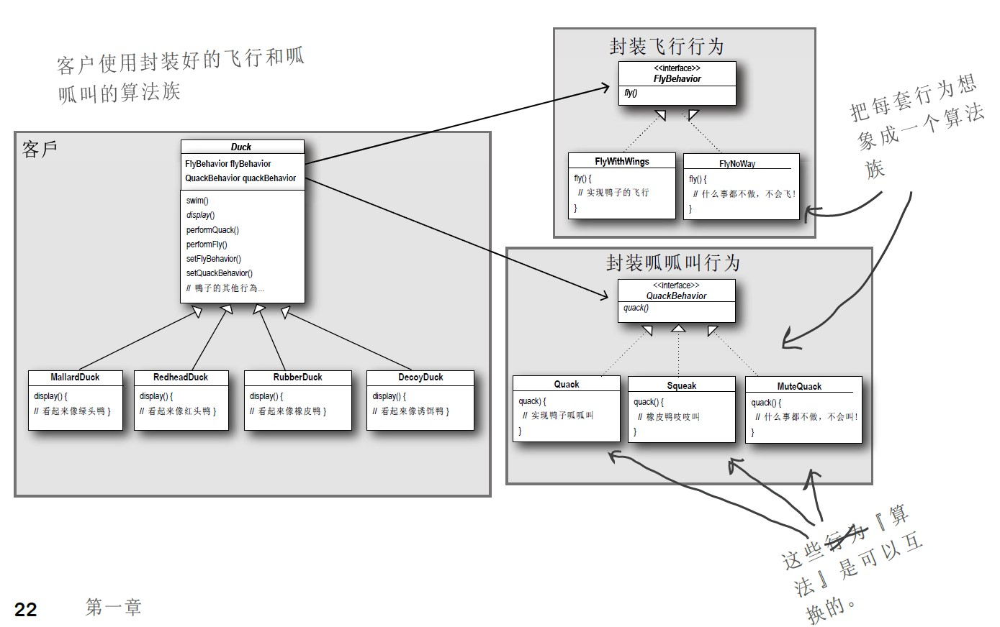

# 策略模式

## 定义
策略模式定义了一簇算法，并把它们分别封装起来，让它们之间可以相互替换。此模式让算法的变化独立于使用算法的客户。


## 实现

定义一个算法簇：描述鸭子的不同飞行行为.算法簇包含两个具体的算法(行为)：FlyWithWings和FlyNoWay。它们都实现自接口FlyBehavior
```java
public interface FlyBehavior {
    void fly();
}
public class FlyWithWings implements FlyBehavior {
    @Override
    public void fly() {
        System.out.println("I can fly with wings");
    }
}
public class FlyNoWay implements FlyBehavior {
    @Override
    public void fly() {
        System.out.println("I can't fly");
    }
}
```
以下为鸭子类，它不需要知道飞行行为的具体细节。因为它已将飞行行为委托给别人处理，而不是在Duck类内部定义这些行为。
```java
public class Duck{
    //FlyBehavior实例变量是一个接口类型，我们能在运行时利用多态为它指定不同的具体实现类。
    private FlyBehavior flyBehavior;
    //不在乎flyBehavior接口的对象是什么，只关心该对象知道如何进行fly动作就够了。
    public void performFly(){
        if(flyBehavior != null)
            flyBehavior.fly();
    }
    //为这个鸭子类设置给定的飞行行为
    //在运行时想改变鸭子的飞行行为，只需调用这个方法即可
    public void setFlyBehavior(FlyBehavior flyBehavior){
        this.flyBehavior = flyBehavior;
    }
}
```
这样一来，因为飞行行为已经和鸭子类解耦（实际上二者为组合关系），因此飞行动作也可以被其他类的对象复用。而且当我们新增飞行行为时，只需要多创建一个实现飞行接口的具体行为类即可，不会影响到既有的具体行为类，也不会影响使用到飞行行为的Duck类。

以下为客户端
```java
public class Client{
    public static void main(String[] args){
        Duck duck = new Duck();
        duck.setFlyBehavior(new FlyWithWings());
        duck.performFly();
        duck.setFlyBehavior(new FlyNoWay());
        duck.performFly();
    }
}
```

输出将依次为：
```
I can fly with wings
I can't fly
```