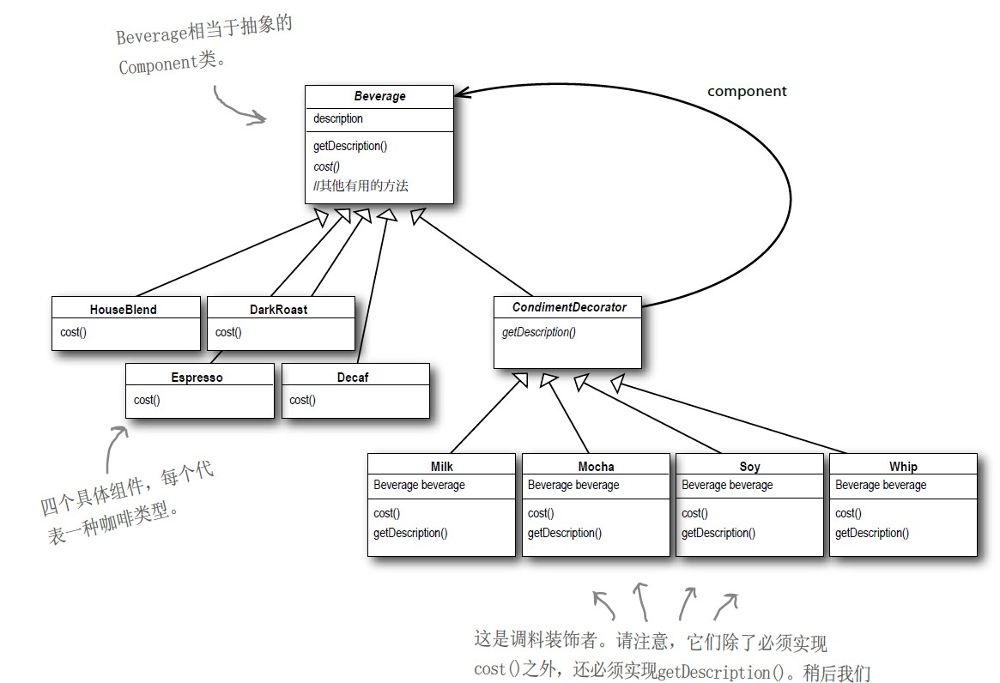

# 装饰者模式

## 定义
动态地为对象扩展功能。

在扩展功能这一方面，装饰者模式比继承更有弹性




## 实现
**实现背景**：一家咖啡店有多种饮料(如咖啡、豆浆），还有多种调料可以添加（如Whip、Mocha）。每种饮料都有一个基础价格，加完调料后，价格即为基础价格加上调料价格。要求我们要计算一杯加过调料的饮料的价格。

所有的装饰者和被装饰者都要继承自抽象类Beverage
```java
public static abstract class Beverage{
    String description;
    public String getDescription(){
        return description;
    }
    public abstract double cost();
}
```
抽象调料类（装饰者），所有的调料类都需继承自这个抽象类
```java
public static abstract class CondimentDecorator extends Beverage{
    //beverage为被装饰者的引用
    protected Beverage beverage;
    @Override
    public abstract String getDescription();
}
```
以下为两个调料类(装饰者类)：
```java
//以下是两个调料类（装饰者）
public static class Mocha extends CondimentDecorator{
    public Mocha(Beverage beverage){
        this.beverage = beverage;
    }
    @Override
    public String getDescription(){
        return beverage.getDescription() + ", Mocha";
    }
    @Override
    public double cost(){
        return beverage.cost() + 1;
    }
}

public static class Whip extends CondimentDecorator{
    public Whip(Beverage beverage){
        this.beverage = beverage;
    }
    @Override
    public String getDescription(){
        return beverage.getDescription() + ", Whip";
    }
    @Override
    public double cost(){
        return beverage.cost() + 2;
    }
}
```

以下是两个饮料类（被装饰者类）
```java
public static class Coffee extends Beverage{
    public Coffee(){
        description = "Coffee";
    }
    @Override
    public double cost(){
        return 5;
    }
}

public static class Soybean extends Beverage{
    public Soybean(){
        description = "Soybean";
    }
    @Override
    public double cost(){
        return 0.6;
    }
}
```


客户端代码：
```java
public static void main(String args[]){
    Beverage beverage = new Soybean();
    beverage = new Mocha(beverage);
    beverage = new Whip(beverage);
    System.out.println(beverage.getDescription() + ", $" + beverage.cost());
    Beverage beverage2 = new Coffee();
    beverage2 = new Mocha(beverage2);
    beverage2 = new Whip(beverage2);
    System.out.println(beverage2.getDescription() + ", $" + beverage2.cost());
}
```